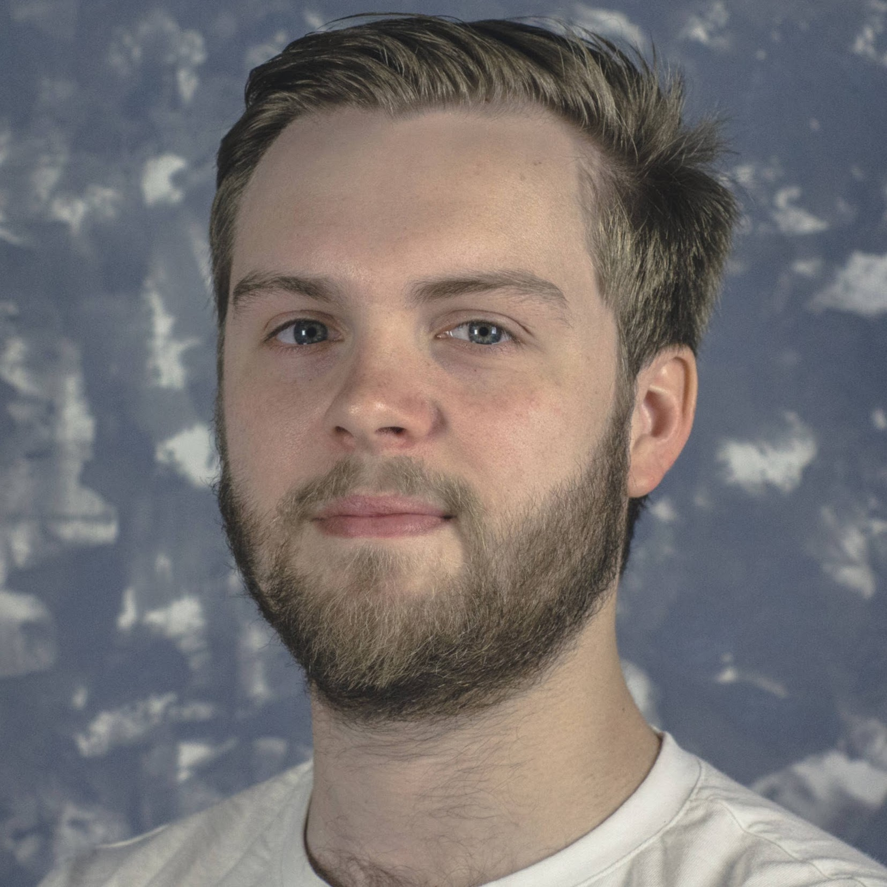

{:class="img-responsive"}{:style="width: 40%; float: right; padding-left: 20px; margin-top: 25px;"}

My name is Eugene de Beste, I'm a South African and work as the systems and cloud guy over at the [South African National Bioinformatics Institute (SANBI)](https://sanbi.ac.za).

I studied and achieved Cum Laude in Computer Science at the University of the Western Cape. My 4th year (Honours for South Africa) was at the University of Cape Town, where I studied and achieved First Honours (Cum Laude) again.

I am currently finishing my Masters Degree at SANBI in portable scientific workflows for data-intensive research.