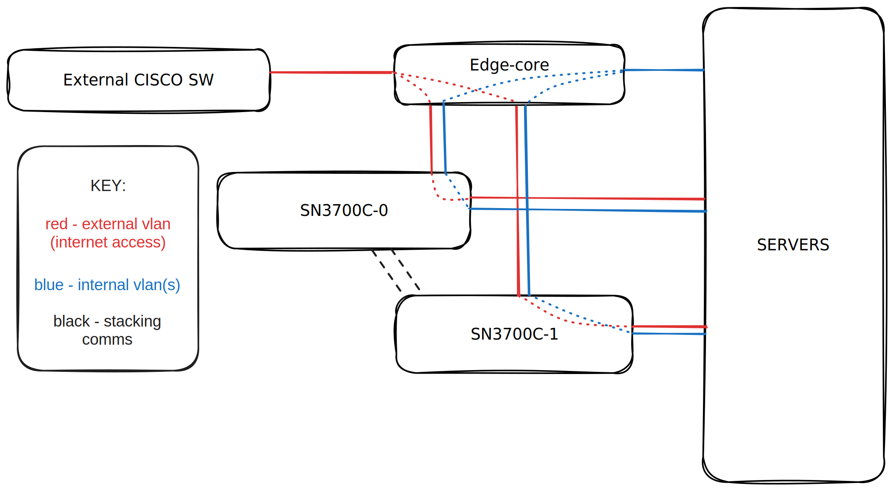

---
cover:
  image: "cumulus-og2x.png"
author: "Eugene de Beste"
title: "External VLANs and (NVIDIA) Cumulus Linux"
date: "2023-06-16"
description: "I've recently had to work with NVIDIA Cumulus Linux. This blog post details how to trunk in an external VLAN from an existing network."
aliases:
    - "/cumulus-linux-vlans"
categories:
    - Technology
tags:
    - Switching
    - Networking
    - Cumulus Linux
    - Linux
    - Linux Bridges

TocOpen: true
---

# Preamble

For the past little while, I've been quite involved in hardware automation. Whether it's spinning up cloud environments (with OpenStack) or working with services on bare-metal machines outside of a cloud-like environment, the common requirement is:

- Power
- Internet (sometimes optional)
- Networking switches
- Servers (for compute, storage, or both)
- Cables (sometimes numerous)

This blog post will focus on some of my recent experiences with Cumulus Linux, as I've had to deal with it as part of a deployment for an OpenStack cloud.


**I want to very clearly state that I, by no means, am a networking expert!**


# Cumulus Linux

I've got to tell you, there's something really cool about connecting to a console port of a switch and seeing a GRUB bootloader operating system selection menu appear during the early phases of booting.

## Background

<figure>
    
    <figcaption style="margin-top: 0px; font-size: 13px; text-align: center"><i>The old Cumulus Linux logo before NVIDIA bought over Cumulus Networks</i></figcaption>
</figure>

Cumulus Linux, now referred to as NVIDIA Cumulus Linux/NVIDIA Linux following the acquisition, is an operating system for bare-metal switching equipment based on Debian. That means you essentially get a fully fledged Linux distribution with certain tweaks/changes to make it more suitable as a network switch OS. As a result, it offers a more traditional switch CLI tool, but it also provides a **full bash shell**.

---

## The Working Environment

The environment that I'm working with in this blog post is as follows:

| Brand         | Model       | Description          | Purpose                   |
|---------------|-------------|----------------------|-------------------------- |
| **Cisco**     | ???         | Unknown              | External VLAN trunk       |
| **Edge-core** | AS4610-54T  | 1GbE RJ45 w/ 4x SFP+ | Management (BMC)          |
| **NVIDIA**    | SN3700C     | 100GbE QSFP28        | LAG mem. 1                |
| **NVIDIA**    | SN3700C     | 100GbE QSFP28        | LAG mem. 2 + Provisioning |

The gist of the networking setup can be demonstrated as below:

<figure>
    
    <figcaption style="margin-top: 0px; font-size: 13px; text-align: center"><i>Basic Layout</i></figcaption>
</figure>

---

## Port Configuration

Some switches come with RJ45, some with SFP or SFP+ or SFP28 or QSFP or... you get the idea. 

Switches with ports that can handle over 10Gbps bandwidth, typically SFP28+, have the ability to modify the rate at which ports can operate. Not only this, but ports can also be described as splitter ports (i.e. 100GbE -> 4x 25GbE). This functionality is provided through the `/etc/cumulus/ports.conf` file. Here's an example from my second SN3700C, creatively dubbed SN3700C-1, running **Cumulus 4.3.0**:

```ini
# ports.conf --
#
#        This file controls port speed, aggregation and subdivision.
#
# For example, the zQSFP ports can be split into multiple interfaces. This
# file sets the number of interfaces per port and the speed of those interfaces.
#
# You must reload switchd for changes to take effect.
#
# mlnx,x86_MSN3700c has:
#     32 QSFP28 ports numbered 1-32
#         These ports are configurable as 40G, 50G, 2x50G, or 100G; or can be
#         split into 4x25G or 4x10G.
#

# QSFP28 ports
#
# <port label>    = [40G|50G|100G]
#   or when split = [2x50G|4x10G|4x25G|disabled]
1=4x25G
2=4x25G
3=4x25G
4=4x25G
5=4x25G
6=4x25G
7=4x25G
8=4x25G
9=4x25G
10=4x25G
11=4x25G
12=100G
13=100G
14=100G
15=4x10G
16=4x10G
17=4x10G
18=4x10G
19=4x10G
20=4x10G
21=4x10G
22=4x10G
23=100G
24=100G
25=100G
26=100G
27=100G
28=100G
29=100G
30=100G
31=100G
32=100G
```

The above configuration indicates that the first 11 ports (1-11) of the SN3700C are being split from 100GbE to 4x 25GbE and is for use with a _**splitter cable**_. These ports are intended for high-performance networking operations, such as an OpenStack API and tenant data plane.

The second set of ports that are modified, 15-22, are made split out from 100GbE to 4x 10GbE SFP+ ports, to be used for slower network operations such as one-shot node provisioning via PXE.


In the working case here, the split out to 4x 10GbE also facilitates the connection between the Edge-core and the SN3700Cs.


---

## Interface Configuration (Bridges and VLANs)

### Context

Internet access needed to be provided to the servers. To do this, we needed to trunk a VLAN (2) from the current external **Cisco** switch to the **Edge-core** and then trunk it further to the two **SN3700C** switches.

```text
       +----------------+        +-----------------+
       |   Cisco        |        |  Edge-core      |
       |  Switch        |        |  Switch         |
       +----------------+        +-----------------+
              |                swp48|    |swp51  |swp52
              |               (rj45)|    |(sfp+) |(sfp+)
              |                     |    |       |
              |                     |    |       |
              |  VLAN (2) trunking  |    |       |
              +---------------------+    |       |
                                         |       |
                                         |       |
               +-------------------------+       |
               |swp32s1                          |swp32s1
               |(sfp+)                           |(sfp+)
       +----------------+        +-----------------+
       |   SN3700C      |        |  SN3700C        |
       |  Switch        |        |  Switch         |
       +----------------+        +-----------------+

```

Unfortunately, we couldn't directly connect the Cisco switch to the SN3700C switches because they have different form factors for cabling. The Cisco switch uses RJ45, which is not compatible with the SN3700C switches.

It's important to note that Cumulus Linux denotes interfaces as `swp<n>`, with `n` being the number that corresponds to the port number.

### Configuration

As I mentioned, Cumulus comes with two main interaction methods:

1. The traditional-like switch CLI tool called "**Network Command Line Utility**" or `nclu`.
2. Editing `/etc/network/interfaces`. Yes. Debian or old-Ubuntu users will feel very at home with this.

Because I'm lazy and more comfortable with `interfaces`, we'll be going with option 2.

Let's look at a default interfaces file:

```conf
# This file describes the network interfaces available on your system
# and how to activate them. For more information, see interfaces(5).

source /etc/network/interfaces.d/*.intf

# The loopback network interface
auto lo
iface lo inet loopback

# The primary network interface
auto eth0
iface eth0 inet dhcp

```

#### Edge-core (entrypoint)

The Edge-core is responsible for carrying the trunked traffic through from the Cisco to the SN3700C's and vice versa. None of the interfaces necessary for the VLAN have been added to the file. Let's begin by creating a virtual bridge interface that can be made aware of the VLAN.

```conf
...

auto internet
iface internet
  bridge-vids 2
  bridge-vlan-aware yes
  bridge-allow-untagged no
```

In the above config, we've prepared a bridge named `internet`, which allows tagging vlan ID `2` and does not allow any untagged traffic to flow. 

Regarding the `bridge-vlan-aware` parameter, suffice it to say that this mode allows us to reduce configuration by having the bridge define the VLANs. It subsequently allows a larger scale of devices to be connected by only having a single instance of the spanning-tree protocol and improving MAC address handling. The NVIDIA documentation says it best, though. [Click here to read more about it](https://docs.nvidia.com/networking-ethernet-software/cumulus-linux-42/Layer-2/Ethernet-Bridging-VLANs/VLAN-aware-Bridge-Mode/).

Now we need to add the port configurations.

```conf
...

auto swp48
iface swp48
  alias cisco-internet

auto swp51
iface swp51
  alias sn3700c-0

auto swp52
iface swp52
  alias sn3700c-1

auto internet
iface internet
  bridge-ports swp48 swp51 swp52
  bridge-vids 2
  bridge-vlan-aware yes
  bridge-allow-untagged no
```

And that's pretty much it for trunking the VLAN through via the respective ports. On to the destination switch configuration.

#### SN3700C's

On the SN3700C's, the `/etc/network/interfaces` file looks much the same as the Edge-core when unconfigured. The interfaces used to connect the SN3700C's on the Edge-core are two SFP+ ports `swp51` and `swp52`.

The SN3700C's need a 100GbE -> 4x 10Gbe SFP+ splitter, which allows communication between the two switches. This results in the ports being represented inside the OS as `swp<n>s<m>`, where `n` is the mapping to the physical port on the switch and `m` is the identifier for an individual cable from the splitter.

In my case, since I used port 32 with a 4x splitter, it results in `swp32s[1-4]`. I am only using the first cable from the splitter, so it's not necessary to consider 2-4.

Let's look at the configuration:

We start with the same bridge creation; however, since I want to use other VLANs to my servers I won't just be dedicating this one for the internet. Because of that, I simply named it `bridge`.

```conf
...

auto bridge
auto bridge
  bridge-vids 2 <other>
  bridge-vlan-aware yes
```

I have a use case for allowing untagged traffic with this switch, but I am not going to to detail it in this post. I wanted to mention this in case you were confused as to why it was left out. In terms of VLANs, it's easy to add multiple by simply adding a space followed by the next VLAN id next to the `bridge-vids` parameter.

Now we can define our ports:

```conf
...

auto swp32s1
iface swp32s1
  alias edgecore-internet

auto bridge
auto bridge
  bridge-ports swp32s1
  bridge-vids 2 <other>
  bridge-vlan-aware yes
```

All that's left is to repeat the interfaces for the nodes that are connected to the SN3700C's, to which we want to provide internet access.

For example, if we had a compute node connected to port swp25, we would change the configuration to look like this:

```
...
auto swp25
iface swp25
  alias compute10

auto bridge
auto bridge
  bridge-ports swp32s1 swp25
  bridge-vids 2 <other>
  bridge-vlan-aware yes
```

# Conclusion

It's interesting working with different networking equipment, and the more I do, the more I realise that I need to learn more about computer networking in general.

I really do enjoy using a familiar Linux-like interface to my networking switches, because I believe that it enables easy-to-read documentation and allows automation tooling (like Ansible) to not have to cater specially to the switch. You could potentially use widely common Ansible modules that configure Debian networking on your switches, just the same as you do with your servers.

All in all, the VLAN configuration on Cumulus Linux is not overly complicated. I hope this posts was helpful in some way.
