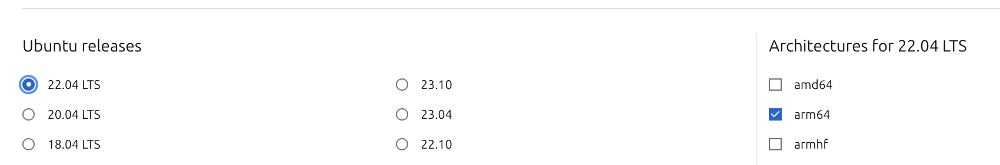
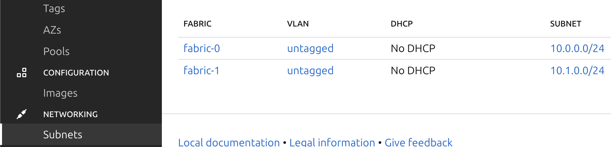
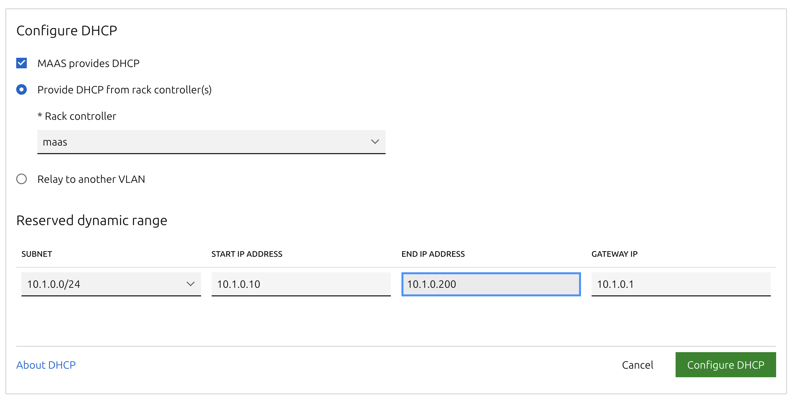

---
cover:
  image: "posts/2024-03-10-dynamic-raspberry-pi-provisioning/banner.jpg"
  relative: false
  alt: "Ubuntu Login Prompt That Says Login Failed."
  #caption: "I'm sorry Dave, I'm afraid I can't do that."
author: "Eugene de Beste"
title: "Automated and Dynamic Raspberry Pi Provisioning For The Lazy Homelabber"
date: "2024-03-10"
description: I'm lazy and don't like to manually re-provision SD cards or SSDs for use with my Raspberry Pi devices. I've developed an environment in which I can re-provision my Pis on demand without any physical intervention, which is useful for rapid prototyping. This blog post details my solution.
categories:
  - Technology
tags:
  - RaspberryPi
  - Homelab
  - Pi

showtoc: true
draft: true
---

Raspberry Pi's are great little devices to various purposes. I've got a couple of Pi4's for my homelab. That said, you'd probably be lying to me if you told me you were enthusiastic about the following scenario, especially if you make a lot of changes and/or try a lot of different operating systems:

1. Unplug Pi
2. Remove storage device (SD/SSD)
3. Plug storage device into PC
4. Flash OS image to device
5. Unplug device from PC
6. Plug back into Pi
7. Plug Pi back in
8. Configure Pi after it boots

I developed a solution for my homelab which allows me to re-provision my Pis on demand, without having to touch any of them. This blog post will detail my solution.


<figure>
    
    <figcaption style="margin-top: 0px; font-size: 13px; text-align: center"><i>My Raspberry Pi Collection</i></figcaption>
</figure>

---

# Requirements

## Hardware

There are a few hardware requirements for getting this going:

- A Raspberry Pi 4 (5 should work, but I don't have any).
- SD card reader.
- A USB-attached HDD/SSD (or NVMe drive if using a Pi5). I use the [Argon ONE M.2 Case](https://argon40.com/products/argon-one-m-2-case-for-raspberry-pi-4) for my Pis.
- A managed PoE+ capable switch which supports SSH connectivity. I use an old [Cisco 2960X](https://www.cisco.com/c/en/us/products/collateral/switches/catalyst-2960-x-series-switches/datasheet_c78-728232.html).
- A device to allow PoE for your Pi, such as [this splitter](https://www.amazon.com/Splitter-Standard-1000Mbps-Ethernet-TYPEC0503G/dp/B09GM8FB3X?th=1).
- Some computer to use as a server to provide network booting services.

## Software

I'm using a combination of Canonical's [MAAS](https://maas.io/) (Metal as a Service) along with a custom Python-based webserver that controls the Cisco switch to change the state of the PoE output on the ports.

---

# Setting Up The Pi

The Raspberry Pi4 does not ship with any embedded OS or firmware installed. It relies on a user to provision an SD card to either change booting parameters or boot to an operating system. We can take advantage of this to create a pre-boot environment that will allow for [PXE booting](https://en.wikipedia.org/wiki/Preboot_Execution_Environment) the Pi.

## Prepare the Firmware

There is a software project that provides UEFI firmware images for the Pi to boot into. It can be found here: https://github.com/pftf/RPi4. The firmware needs to be written to an SD card for the Pi to originally boot from.

1. Before performing this process, the Pi needs to be set to boot from SD card first. If this isn't already done, an SD card needs to be prepared to flash this instruction to the Pi EEPROM.
    1. Download the Raspberry Pi Imager software here: https://www.raspberrypi.com/software/.
    2. For "**Raspberry Pi Device**" choose the Raspberry Pi you have (4 or 5).
    3. For "**Operating System** click **CHOOSE OS** -> **Misc utility images** -> **Bootloader** -> **SD Card Boot**.
    4. For "**Storage**" select your SD card and click **NEXT** and complete the flashing process.
    5. Put the SD card in the Pi and boot it once. It should have a green screen. This means it has successfully updated the EEPROM.
    6. Remove the SD card from the Pi.
2. Retrieve the [v1.34 UEFI firmware](https://github.com/pftf/RPi4/releases/download/v1.34/RPi4_UEFI_Firmware_v1.34.zip) from https://github.com/pftf/RPi4/releases. I use v1.34 instead of v1.35 due to a bug that prevents it from working consistently.
3. Follow the instruction for installing the UEFI firmware onto the SD card: https://github.com/pftf/RPi4?tab=readme-ov-file#installation.
4. After flashing the UEFI firmware, edit the `config.txt` file on the resulting SD card partition and add the following:
    ```ini
    ...
    hdmi_force_hotplug=1
    hdmi_group=1
    hdmi_mode=16
    ```
    This will enable the HDMI output on the Pi even if there was no HDMI device plugged into it at power on time.

    If any other customization is needed (e.g. additional overlays), make those now.
5. Put the SD card into the Pi and boot it. When you see the UEFI initialization screen, hit ESC to enter the setup screen. A couple of things need to be changed:
    1. Remove the 3GB RAM limit:

        **Device Manager** -> **Raspberry Pi Configuration** -> **Advanced Settings**.
    2. Ensure that network booting is set to be first in the boot order:

        **Boot Maintenance Manager** -> **Change Boot Order** and set UEFI PXEv4 to first and UEFI HTTPv4 to second. For extra measure, go to the **Delete Boot Order** menu and delete everything that isn't those two.
6. Reboot the Pi, but don't let it complete a boot process at this stage. Unplug the power and remove the SD card.

## Lock the SD card

Due to a quirk with the UEFI firmware, the boot order gets lost when a new EFI boot entry is written (this will happen on a new OS install). The SD card needs to be software locked to combat this. There is a tool hosted on Github that enables this: https://github.com/BertoldVdb/sdtool.

1. Grab the repository zip and extract it: https://github.com/BertoldVdb/sdtool/archive/refs/heads/master.zip
2. Compile the application with `make`.
3. Insert the SD card into your Linux machine and run the lock command on it:
    ```bash
    # sd card is usually at /dev/mmcblk<something>
    ./sdtool /dev/<sdcard> lock
    ```
4. Insert the SD card back into the Pi.

The Pi is now ready to go.

---

# Setting Up MAAS

Canonical makes a tool called MAAS (Metal as a Service). This tool is a glorified wrapped around a DHCP server that allows you to do management of bare metal machines (and more). It's a simple enough and pretty effective tool and it's what I use to manage my fleet of Pi devices, as well as a few other. 

For this post, I'm assuming that an Ubuntu environment is being used, and that networking is already configured in a way that will support a new DHCP server not interfering with normal network operation, such as with VLANs.

## Installation

I'm not a huge fan of Canonical's snap packages, so I stick to the packaged-based installs. I'm providing brief deployment steps here, assuming that MAAS is being deployed on Ubuntu Server 22.04. This will be for MAAS 3.4, which was the latest at the time of writing.

Full documentation can be found on their site: https://maas.io/docs/fresh-installation-of-maas

1. Install the MAAS packages
    ```bash
    sudo apt-add-repository -y ppa:maas/3.4
    sudo apt install -y maas
    ```
2. Create the admin user
    ```bash
    sudo maas createadmin
    ```

Now you can navigate to http://<ip_address>:5240/MAAS in your browser and log in to the web UI.

## Configuration

Once logged in to the MAAS web UI, set your Region name and DNS forwarders and click "**Save and continue**"


For images, select any combination of Ubuntu 22.04, 23.04 and/or 23.10, ticking on the _arm64_ architecture followed by the "**Update selection**" button. The guest operating system needs to be at least kernel 5.15 for things to work reliably. I haven't tested any older kernels except for that running on 20.04 and the Pi will not boot on that. I haven't looked too much into it, because it's old anyway.




After that, click "**Continue**" followed by "**Finish setup**". 

If you didn't upload an SSH public key during the admin user creation during the installation, MAAS will now prompt for this. A public key is required as MAAS uses cloud-init based deployments which inject public keys into the default `ubuntu` user account, opting to have passwords disabled by default. 

## Networking

In my example setup, the MAAS server has two network interfaces:

| Interface  | CIDR        | Description           |
|------------|-------------|-----------------------|
| **enp0s3** | 10.0.0.0/24 | NAT/Internet          |
| **enp0s8** | 10.1.0.0/24 | MAAS DHCP for Pi's    |

The **enp0s8 (10.1.0.0/24)** interface needs to be configured in MAAS. Interfaces and their subnet should already show up in **NETWORKING** -> **Subnets**.



### DHCP

In this example, I don't have any VLANs. I can simply activate DHCP for the _untagged_ "VLAN" associated with the fabric that is associated with enp0s8 (_fabric-1_ in this case).

Clicking on _untagged_ next to _fabric-1_ and scrolling down will reveal a "**_Configure DHCP_**" button. Click it, select your "Rack controller" and select the appropriate subnet CIDR, starting address, ending address and gateway. Since this MAAS server will act as a NAT router for the Pi's, it's own internal IP will be the gateway.



That concludes the basic setup for MAAS. The only thing to do is ensure that NAT is working on the node so that your Pi's can get internet via the MAAS server.