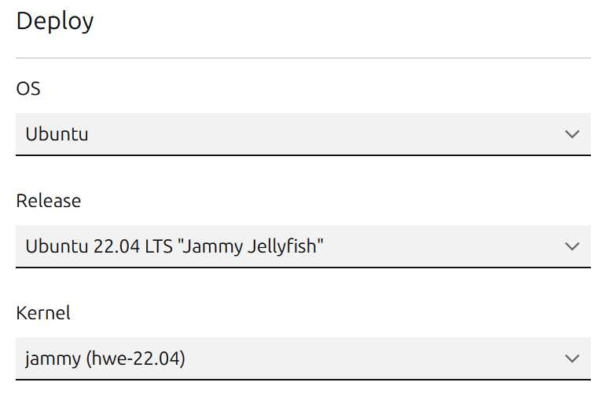

---
cover:
  image: "posts/2024-03-10-dynamic-raspberry-pi-provisioning/banner.jpg"
  relative: false
  alt: "Images of Tools and Technologies Used For This Blog."
  #caption: "I'm sorry Dave, I'm afraid I can't do that."
author: "Eugene de Beste"
title: "Automated and Dynamic Raspberry Pi Provisioning For The Lazy Homelabber Featuring Canonical MAAS and Python"
date: "2024-03-10"
description: I'm lazy and don't like to manually re-provision SD cards or SSDs for use with my Raspberry Pi devices. I have developed an environment in which I can re-provision my Pis on demand without any physical intervention, which is useful for rapid prototyping. This blog post details my solution.
categories:
  - Technology
tags:
  - RaspberryPi
  - Homelab
  - Pi
  - Automation
  - Python
  - Code
  - API

showtoc: true
TocOpen: true
---

Raspberry Pi's are great little devices for various purposes. I've got a couple of Pi4's for my homelab. That said, you'd probably be lying to me if you told me you were enthusiastic about the following scenario, especially if you make a lot of changes and/or try a lot of different operating system versions:

1. Unplug Pi
2. Remove storage device (SD/SSD)
3. Plug storage device into PC
4. Flash OS image to device
5. Unplug device from PC
6. Plug back into Pi
7. Plug Pi back in
8. Configure Pi after it boots

I developed a solution for my homelab which allows me to re-provision my Pis on demand using a more traditional remote-provisioning paradigm, without having to touch any of them. This blog post will detail my solution.

<figure>
    
    <figcaption style="margin-top: 0px; font-size: 13px; text-align: center"><i>My Raspberry Pi Collection</i></figcaption>
</figure>

---

# Requirements

## Hardware

There are a few hardware requirements for getting this going:

- A Raspberry Pi 4 (5 should work, but I don't have any...).
- An SD card reader that exposes SD cards raw (`/dev/mmblk*`).
- A USB-attached HDD/SSD (or NVMe drive if using a Pi5). I use the [Argon ONE M.2 Case](https://argon40.com/products/argon-one-m-2-case-for-raspberry-pi-4).
- A managed PoE+ capable switch which supports SSH connectivity. I use an old [Cisco 2960X](https://www.cisco.com/c/en/us/products/collateral/switches/catalyst-2960-x-series-switches/datasheet_c78-728232.html).
- A device to allow PoE for the  Pi, such as [this splitter](https://www.amazon.com/Splitter-Standard-1000Mbps-Ethernet-TYPEC0503G/dp/B09GM8FB3X?th=1).
- Some computer to use as a server to provide network booting services.

## Software

I'm using a combination of Canonical's [MAAS](https://maas.io/) (Metal as a Service) along with a custom Python-based API server that controls the Cisco switch to change the state of the power output on the ports.

---

# Setting Up The Pi

The Raspberry Pi 4 does not ship with any embedded OS or UEFI firmware installed. It relies on a user to provision an SD card to either change booting parameters (like telling it to boot via SD card or USB) or boot to an operating system. We can take advantage of this to create a pre-boot environment that will allow for [PXE booting](https://en.wikipedia.org/wiki/Preboot_Execution_Environment) the Pi.

## Prepare the Firmware

There is a software project that provides UEFI firmware images for the Pi 4 to boot into. It can be found here: https://github.com/pftf/RPi4. The firmware needs to be written to an SD card for the Pi to originally boot from, before it can boot from another source.

1. Before performing this process, the Pi needs to be set to boot from SD card. If this isn't already done, an SD card needs to be prepared to flash this instruction to the Pi EEPROM.
    1. Download the Raspberry Pi Imager software here: https://www.raspberrypi.com/software/.
    2. For "**Raspberry Pi Device**" choose the correct Raspberry Pi version (4 or 5).
    3. For "**Operating System** click **CHOOSE OS** -> **Misc utility images** -> **Bootloader** -> **SD Card Boot**.
    4. For "**Storage**" select the SD card and click **NEXT** and complete the flashing process.
    5. Put the SD card in the Pi and boot it once. It should display a big solid-green screen. This means it has successfully updated the EEPROM.
    6. Remove the SD card from the Pi.
2. Retrieve the [v1.34 UEFI firmware](https://github.com/pftf/RPi4/releases/download/v1.34/RPi4_UEFI_Firmware_v1.34.zip) from https://github.com/pftf/RPi4/releases. I'm using this older release as the newer ones seem to have a bug that causes some OSes I've tested to not boot. Something about signatures. I haven't looked into it.
3. Follow the instructions for installing the UEFI firmware onto the SD card: https://github.com/pftf/RPi4?tab=readme-ov-file#installation.
4. After flashing the UEFI firmware to the SD card, edit the `config.txt` file on the resulting SD card partition and add the following:
    ```ini
    ...
    hdmi_force_hotplug=1
    ```
    This will enable the HDMI output on the Pi even if there was no HDMI device plugged into it at power on time. If you have issues with the Pi not booting without HDMI plugged in, try adding the following as well:

    ```ini
    ...
    hdmi_force_hotplug=1
    hdmi_group=2
    hdmi_mode=82
    ```
    This forces a 1920x1080p progressive output from HDMI. Read more about it here: https://onlinelibrary.wiley.com/doi/pdf/10.1002/9781119415572.app3
    <br />
    <br />

    _**If any other customization is needed (e.g. additional overlays), do that now.**_

5. Put the SD card into the Pi and boot it. When the UEFI initialization screen comes up, hit ESC to enter the setup screen. A couple of things need to be changed (make sure to hit **F10** to save changes):
    1. Remove the 3GB RAM limit:

        **Device Manager** -> **Raspberry Pi Configuration** -> **Advanced Settings**.
        
    2. Ensure that network booting is set to be first in the boot order:

        **Boot Maintenance Manager** -> **Boot Options** -> **Change Boot Order** and set UEFI PXEv4 to first and UEFI HTTPv4 to second. For extra measure, go to the **Delete Boot Option** menu and delete everything that isn't those two.
        
6. Reboot the Pi, but don't let it complete a boot process at this stage. Unplug the power and remove the SD card.

## Lock the SD card

Due to a quirk with the UEFI firmware, the boot order gets lost when a new EFI boot entry is written (this will happen on a new OS install). The SD card needs to be software locked to combat this. There is a tool hosted on Github that enables this: https://github.com/BertoldVdb/sdtool.

1. Grab the repository zip and extract it: https://github.com/BertoldVdb/sdtool/archive/refs/heads/master.zip
2. Compile the application with `make`.
3. Insert the SD card into a Linux machine and run the lock command on it:
    ```bash
    # sd card is usually at /dev/mmcblk<something>
    ./sdtool /dev/<sdcard> lock
    ```
4. Insert the SD card back into the Pi.

The Pi is now ready to go.

---

# Setting Up MAAS

Canonical makes a tool called MAAS (Metal as a Service). This tool is a glorified wrapped around a DHCP server that allows for management of bare metal (and more) machines. It's a simple enough and pretty effective tool and it's what I use to manage my fleet of Pi devices, as well as a few other. 

For this post, I'm assuming that an Ubuntu environment is being used, and that networking is already configured in a way that will support a new DHCP server not interfering with normal network operation, such as with VLANs.

## Installation

I'm not a huge fan of Canonical's snap packages, so I stick to the packaged-based installs. I'm providing brief deployment steps here, assuming that MAAS is being deployed on Ubuntu Server 22.04. This will be for MAAS 3.4, which was the latest at the time of writing.

Full documentation can be found on their site: https://maas.io/docs/fresh-installation-of-maas

1. Install the MAAS packages
    ```bash
    sudo apt-add-repository -y ppa:maas/3.4
    sudo apt install -y maas
    ```
2. Create the admin user
    ```bash
    sudo maas createadmin
    ```

Now navigate to http://<ip_address>:5240/MAAS in a web browser and log in to the web UI.

## Configuration

Once logged in to the MAAS web UI, set the Region name and DNS forwarders and click "**Save and continue**"


For images, select any combination of Ubuntu 22.04, 23.04 and/or 23.10, ticking on the _arm64_ architecture followed by the "**Update selection**" button. The guest operating system needs to be at least kernel 5.15 for things to work reliably on the Pi 4. I haven't tested any older kernels except for the one that runs on 20.04 and the Pi will not boot on that. I haven't looked too much into it, because it's old anyway.


After that, click "**Continue**" followed by "**Finish setup**". 

If an SSH public key wasn't uploaded during the admin user creation during the installation, MAAS will now prompt for this. A public key is required as MAAS uses cloud-init based deployments which inject public keys into the default `ubuntu` user account, opting to have passwords disabled by default. 

Now go to **left side menu** -> **Settings** -> **Configuration/Commissioning** and select "_Default Ubuntu release used..._" to be the "_Ubuntu 22.04 LTS "Jammy Jellyfish"_. Also set "_Default minimum kernel version_" to "_jammy (hwe-22.04)_".


## Networking

In my example setup, the MAAS server has two network interfaces:

| Interface  | CIDR        | Description           |
|------------|-------------|-----------------------|
| **enp0s3** | 10.0.0.0/24 | NAT/Internet          |
| **enp0s8** | 10.1.0.0/24 | MAAS DHCP for Pi's    |

The **enp0s8 (10.1.0.0/24)** interface needs to be configured in MAAS. Interfaces and their subnet should already show up in **NETWORKING** -> **Subnets**.


In this example, I don't have any VLANs. I can simply activate DHCP for the _untagged_ "VLAN" associated with the fabric that is associated with enp0s8 (_fabric-1_ in this case).

Clicking on _untagged_ next to _fabric-1_ and scrolling down will reveal a "**Configure DHCP**" button. Click it, select the default "Rack controller" and select the appropriate subnet CIDR, starting address, ending address and gateway. In this example this MAAS server will act as a NAT router for the Pi's, so it's own internal IP will be the gateway.


That concludes the basic setup for MAAS. The only thing to do is ensure that NAT is working on the node so that the Pi's can get internet via the MAAS server.

---

# Enrolling and Deploying the Pi

Now for the fun part!

Make sure that a storage device (USB) plugged into the Pi for an operating system to be provisioned onto. Plug the Pi into the MAAS DHCP-provided network, turn it on and watch the magic work!



_**There is a little quirk where display output stops after the 3 "EFI Stub:" messages appear. Rest assured that things should be working in the background. I believe this may be related to missing firmware or framebuffer issues or something.**_


After a few minutes, the Pi should show up in the MAAS Machines menu with a randomly generated name 🥳:


When it's done enrolling, it'll appear under "New".

## Initial Configuration

Click into the device and configure its proper name by clicking the random-assigned name on the top of the screen.

The power configuration must now be set for any actions to be allowed in MAAS. Go to "**Configuration"** inside of the device page, click "**Edit**" and change "**Power type**" to "**Manual**".


## Commission the Pi

The Pi device must now be commissioned. This is where MAAS does extended device discovery and additional checks. From the Pi's page click "**Actions**" -> **Commission...**. In the popup menu, tick on "**Skip configuring supported BMC controllers with a MAAS generated username and password** and press "**Start commissioning for machine**. 


Once commissioning has begun, the Pi needs to manually be turned on again, so do that now.



This process will take some time. Kick back and go make a cup of coffee. The status of the Pi's commissioning will update as it goes on the Machines overview page in MAAS.

## Configuring the Pi

Network is a little tricky. At this stage I haven't been able to get VLANs to work on the Pi when configured from MAAS. When assigning VLANs and installing, things work fine, but on first-boot into the final OS network is not brought up, meaning the Pi is not reachable.

At this stage I believe it's either due to network device name length limitations (which aren't solved by renaming the interface in MAAS) or some other quirk of the Pi hardware on Ubuntu. I need to do more digging. Due to this I only set the flat network settings here (static IP) and do network changes with Ansible.


If you assign VLANs, network may not work correctly. Assign VLANs after the device has been provisioned, outside of MAAS.


For storage, I'm usually happy with the default layout. The only potential quirk to be aware of is if the SD card appears in the list of storage devices (older MAAS versions, I believe). If that is the case, make sure that you **REMOVE** it from MAAS management entirely in the storage menu. Only have the USB-attached (or NVMe if you have a Pi5) storage present in MAAS.

## Deploy Ubuntu to the Pi

Now it's simply: **Actions** -> **Deploy** and selecting the OS and kernel. In this example I deploy with Ubuntu 22.04 and jammy (hwe-22.04) kernel.


Once again, after clicking deploy, the Pi needs to be manually power cycled.




Once the Pi has completed the deployment process and rebooted, it becomes available to use! 🎉🎉🎉


If a static IP address wasn't used, the automatically assigned address can be found in the network tab of the machine page.



Now the Pi can be released and redeployed on demand! When changing to a different operating system (e.g. 22.04 to 23.10), it's a good idea to re-commission the Pi with the new operating system too, as otherwise there may be differences between how kernel versions expose devices leading to failed deployments.

--- 

# Automating Pi Power

The final step in fully automating this process is to figure out how to remotely control the power state.

There are different ways that this challenge can be tackled. The there is an example here: https://maas.io/tutorials/build-your-own-bare-metal-cloud-using-a-raspberry-pi-cluster-with-maas#5-install-and-configure-maaspower where the author uses a hardware device that sits between the Pi and the power source and can receive commands via REST API calls to turn on/off. I wanted to do something similar, but I didn't want to buy any additional hardware.

Since I power my Pi's from a managed network switch with Power-over-Ethernet, I figured why not manipulate the switch to control the power. So that's what I did.

My Cisco 2960X allows me to manage it in various ways, one of those being SSH. I looked through the Cisco documentation to find what the configuration line is for controlling the state of power output. This turns out to be `power inline never` for turning it off, and removing the configuration line with `no power inline` for turning it on.

## The Power of Code

Using the knowledge I gained from above, I wrote a Flask/Python API server to listen to incoming requests and perform actions on the switch using SSH.

The boilerplate is:

```python
# imports, functions and other logic...
# ...

app = Flask(__name__)

@app.route('/setpower', methods=['POST'])
def setpower():
    """turn power on or off for a switch port"""
    
@app.route('/getpower', methods=['GET'])
def getpower():
    """get whether power is on or off for a switch port"""

app.run(host='0.0.0.0', port=8000)
```

The code is here: https://github.com/db-HomeLab/maas-pi-poe-webhook. Don't judge, I'm not a developer 😁.

For those that are interested: the code uses paramiko to establish SSH connections to the switch and execute the commands to modify the `power inline` configuration line for the port number that is specified.

This API server listens to POST or GET requests of the following nature:

| Request | Endpoint                                                 | Action             |
|---------|----------------------------------------------------------|--------------------|
| POST    | /setpower?portNum=`<port_num>`&powerState=`<true\|false>` | Turn power on/off  |
| GET     | /getpower?portNum=`<port_num>`                           | Get state of power |

Where `<port_num>` is the port number on the switch which a Pi device is plugged into and `<true\|false>` is the power state that the port should be in.

## Running and Using the Code

On the MAAS server I created the following systemd unit to invoke the script at `/etc/systemd/system/maas-pi-poe-webhook.service`:

```ini
[Unit]
Description=maas-pi-poe-webhook
After=syslog.target network.target

[Service]
Type=simple
User=edebeste
WorkingDirectory=<path_to>/maas-pi-poe-webhook
ExecStart=<path_to>/maas-pi-poe-webhook/venv/bin/python /home/edebeste/maas-pi-poe-webhook/app.py
Restart=on-abort

[Install]
WantedBy=multi-user.target
```
Then start it and enable it for starting up automatically on reboots:

```shell
sudo systemctl enable --now maas-pi-poe-webhook
```

Navigating back to MAAS, clicking on the Pi and navigating to **Configuration**, the Power Configuration section can be edited from **Power Type: Manual** to **Power Type: Webhook** with the following parameters:

| Parameter                                          | Value |
|----------------------------------------------------|-|
| URI to power on the node                           | `http://<maas_server_ip>:8080/setpower?portNum=<switch_port_num_for_pi>&powerState=true` |
| URI to power off the node                          | `http://<maas_server_ip>:8080/setpower?portNum=<switch_port_num_for_pi>&powerState=false` |
| URI to query the nodes power status                | `http://<maas_server_ip>:8080/getpower?portNum=<switch_port_num_for_pi>` |
| Regex to confirm the node is on                    | `status.*\:.*running` |
| Regex to confirm the node is off                   | ` status.*\:.*stopped` |
| Verify SSL connections with system CA certificates | `No` |

And that's it! Now the Pi can be turned on/off on demand. Note that this is not a graceful way to control the power, as the Pi is hard-shutoff. If data is being written as the device power is cycled, there may be risk of loss. However for my use-case, which is experimenting and prototyping, that's perfectly acceptable!


---

# Conclusion

I've had this setup for a little while but haven't had the motivation to write it up. I hope that it helps inspire others to give something similar a try or to think of more creative automation solutions. I'd love to hear what other people are doing with their homelabs so feel free to get in touch with me!