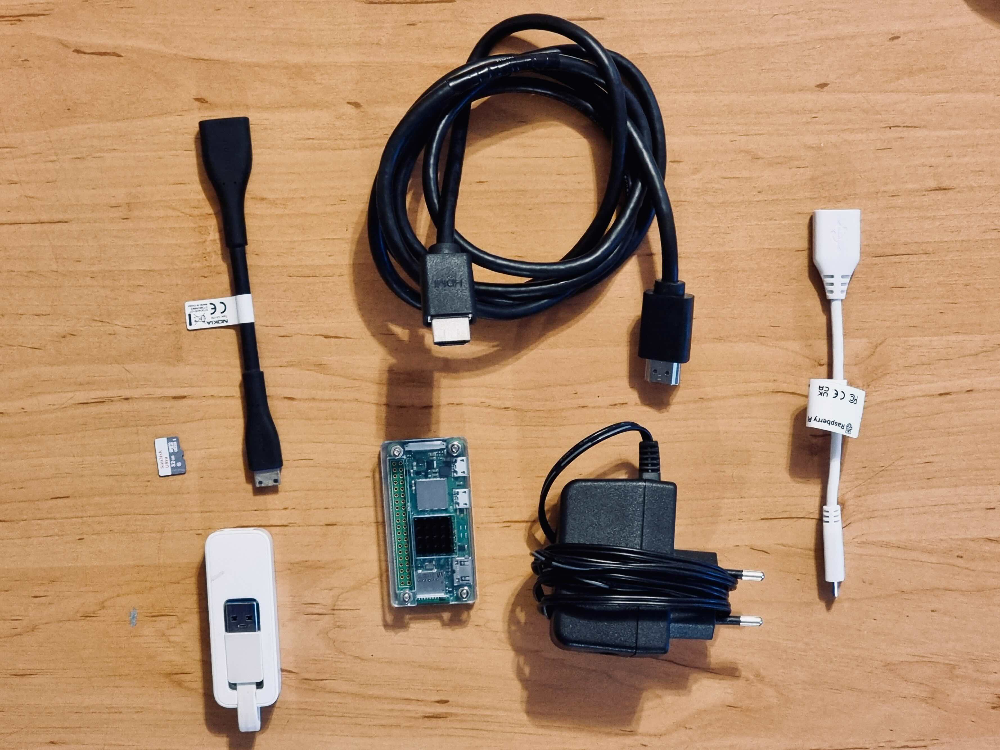

---
cover:
  image: "posts/2024-03-17-pi-zero2-cctv/banner.jpg"
  relative: false
  #alt: "Ubuntu Login Prompt That Says Login Failed."
  #caption: "I'm sorry Dave, I'm afraid I can't do that."
author: "Eugene de Beste"
title: "Wireless Pi Zero 2 Powered CCTV Monitor on the Cheap"
date: "2024-03-17"
description: Not too long ago I set up a few IP cameras around the house. I wanted a non-proprietary way to monitor the feeds while I'm in my study. This blog details my solution leveraging a Raspberry Pi Zero 2 W and an old monitor.
categories:
  - Technology
tags:
  - RaspberryPi


showtoc: true
TocOpen: true
draft: true
---

Not too long ago I set up a few IP cameras around the house. As I work mostly from home, I wanted a non-proprietary and cost effective way to monitor four video feeds at any time while I'm in my study.

This blog details the solution I came up with, which leverages a Raspberry Pi Zero 2 W and an old monitor I had lying around.

# Hardware Requirements



- A Raspberry Pi Zero 2 (W if you want to do it wirelessly).
  - (**Optional**) A USB OTG cable if you're not using WiFi.
  - (**Optional**) A USB to Ethernet adapter if you're not using WiFi.
  - (**Optional, but highly recommended!**) A heatsink and enclosure for the Pi.
  - A mini HDMI to HDMI breakout for the Pi.
  - A power supply for the Pi.
- A microSD card reader/writer for burning the Pi image.
- An old HDMI-compatible computer monitor, either one laying around or getting a cheap one on the second-hand market.
- An HDMI cable.

It's probably easiest to just buy a bundle for the Pi Zero 2, which normally includes most of the stuff neede on the Pi side.

# Software Requirements

The only requirement before getting started is to download an older, archived 32-bit version of Raspberry Pi OS based on Debian 10 (Buster). The last released build is hosted here: https://downloads.raspberrypi.org/raspios_lite_armhf/images/raspios_lite_armhf-2021-05-28/.

The reason for this is that I leverage a tool for displaying the camera feeds which relies on an older video player called `omxplayer`. `omxplayer` supports the hardware acceleration on Pis, but is deprecated on newer versions of RaspiOS. While `vlc` can do hardware acceleration in newer RaspiOS versions, I've found that `omxplayer` has slightly better latency when streaming the feeds.

# Setting it Up

## Flash the MicroSD Card

On a desktop/laptop, prepare the microSD card for the Pi.

## Get Displaycameras

Once the Pi has powered up and has been logged into via SSH, run the following commands to install the software:

```shell
sudo su
cd /tmp
apt update

# Install dependencies for displaycameras
apt install git omxplayer fbi vim -y

# Download the source code for displaycameras
git clone https://github.com/Anonymousdog/displaycameras.git
cd displaycameras

# Install displaycameras
chmod +x install.sh
./install.sh
```

When prompted about setting up the GPU split, enter `128` and hit enter.

## Configure the Pi

I had some issues with runnin
```
framebuffer_width=1280
framebuffer_height=720
hdmi_force_hotplug=1
hdmi_group=2
hdmi_mode=85
```

```
reboot
```

## Configure displaycameras
uncomment blanking in displaycameras.conf

```
blank="true"
```

/etc/displaycameras/layout.conf.default

```
# This is the camera feed/windows layout configuration file for the
# displaycameras service.  It ONLY configures the layout and feeds for
# the cameras; the rest of the configuration is in displaycameras.conf.
# See the comments in that file for notes on configuring the below.

# This example defines seven 640x360 windows, three of which are off-screen to the right,
# through which the service rotates six camera feeds (it actually uses only six windows)
# on a 1280x720 monitor.  If this suites your needs, modify only the camera names to taste
# and feed URLs to what your cameras or NVR provides.

# Window names

# 2x2 screen (for 1280x720 screens)
windows=(upper_left upper_right lower_left lower_right)
# Make sure to account for each window above in the list below.

# Windows positions

window_positions=(
#First Row
#upper_left
# 640x360
"0 0 639 359" \
#upper_right
"640 0 1279 359" \

#Second Row
#lower_left
"0 360 639 719" \
#lower_right
"640 360 1279 719" \
)

# Camera Names

camera_names=(test1 test2 test3 test4)
# Make sure to account for each camera above in the list of feeds below.

# Camera Feeds

camera_feeds=(
"<camera_url_one>" \
"<camera_url_one>" \
"<camera_url_one>" \
"<camera_url_one>" \
)

# Are we rotating cameras through the window matrix?  Set this explicitly to
# "false" if not desired in this display layout.
rotate="false"
```

```
systemctl enable displaycameras
systemctl restart displaycameras
```