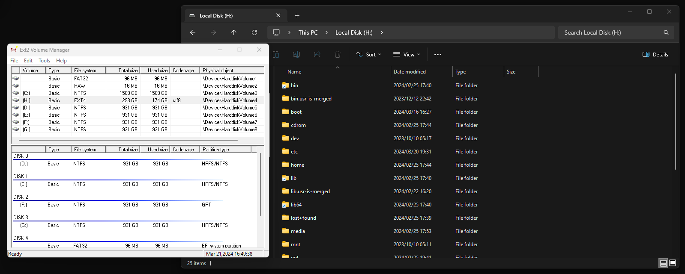

---
cover:
  image: "posts/2024-03-21-mount-ext4-windows-without-wsl/banner.jpg"
  #relative: false
  alt: "A match made in heaven?"
  caption: "Computer says no."
author: "Eugene de Beste"
title: "When WSL Fails You: Mounting ext4 Linux Partitions on Windows When They're on the Same Drive as C:"
date: "2024-03-21"
description: Still dual-booting Windows and Linux for experimentation reasons, I tried copying files from my Linux partition (on the same SSD as C:) to Windows. I quickly found that it's not supported in WSL, so I had to find a workaround.
categories:
  - Technology
tags:
  - Linux
  - Windows
  - Dual-boot
  - WSL
  - WSL2
  - Filesystems


showtoc: true
TocOpen: true
---

I'm one of the (probably) few people that still dual-boot Windows and Linux. There are plenty things that are easier for me to do on a Linux host rather than in Windows, even with WSL being quite useful these days. An example of this is virtualization related experiments (specifically with Qemu/KVM).

A little while back I started writing an upcoming blog post while booted into Linux and took some screenshots that I wanted to use for it. Like a rookie, I pushed the draft of the post to git, but didn't include the screenshots.

While continuing on with writing the post, now in Windows, I needed a way to copy the files from the partition that lives on the same SSD as my Windows C: partition to said C: drive.

---

# The Broken Way

Ez-pz, I'll just use the new fancy WSL features that allow this, right? _**WRONG**_.

WSL includes support for mounting Linux filesystems with the following command:

```powershell
wsl --mount \\.\PHYSICALDRIVE<number> [--partition <number>]
```

Identifying the desired **PHYSICALDRIVE** number of the target disk can be done using `wmic`:

```text
### List disk drives
PS> wmic diskdrive list brief

### Output:
Caption                             DeviceID            Model                               Partitions  Size
ST1000DM003-1SB10C                  \\.\PHYSICALDRIVE2  ST1000DM003-1SB10C                  1           1000202273280
Samsung SSD 860 EVO 1TB             \\.\PHYSICALDRIVE0  Samsung SSD 860 EVO 1TB             1           1000202273280
Samsung SSD 870 EVO 1TB             \\.\PHYSICALDRIVE1  Samsung SSD 870 EVO 1TB             1           1000202273280
Seagate FireCuda 530 ZP2000GM30023  \\.\PHYSICALDRIVE4  Seagate FireCuda 530 ZP2000GM30023  3           2000396321280
Samsung SSD 870 EVO 1TB             \\.\PHYSICALDRIVE3  Samsung SSD 870 EVO 1TB             1           1000202273280
```

The _Seagate FireCuda_ drive is the one I care about, so I need to target `\\.\PHYSICALDRIVE4`.

Figuring out the partition is also relatively simple with `diskpart`:

```powershell
diskpart
list disk
sel disk <number>
list part
```

Which, for me, results in:

```text
  Partition ###  Type              Size     Offset
  -------------  ----------------  -------  -------
  Partition 1    System             100 MB  1024 KB
  Partition 2    Reserved            16 MB   101 MB
  Partition 3    Primary           1569 GB   117 MB
  Partition 4    Unknown            293 GB  1569 GB   <--- this guy
```

Now that I know I need `\\.\PHYSICALDRIVE4` and partition `4`, I attempt to mount:

```powershell
wsl --mount \\.\PHYSICALDRIVE4 --partition 4
```

And am presented with the wonderful error message:

```text
Error code: Wsl/Service/AttachDisk/WSL_E_ELEVATION_NEEDED_TO_MOUNT_DISK
```

😔

There are others afflicted by this terrible terrible error, too: https://github.com/microsoft/WSL/issues/8773

---

# The Working Way

Not wanting to spend too much time on it, I looked for alternatives. I remember using a tool called Ext2Fsd baaaaack in the day to accomplish this, but the builds are now very out of date, wth the [last update being circa 2017](https://sourceforge.net/projects/ext2fsd/files/Ext2fsd/0.69/).

After some Google-fu, I found an experimental revival fork of the project here: https://github.com/bobranten/Ext4Fsd. These diligent folk worked on signing the driver for use in Windows 10 and 11. I'll let their `README.md` do the explaining:

> This is a branch of the Ext2Fsd project by Matt Wu where I try to
> implement support for metadata checksums and jbd2. I have also
> updated the project so it can be compiled with Visual Studio 2019
> and Visual Studio 2022.
> The current status of the development is that all metadata checksums
> is implemented and jbd2 is ported to support 64-bit blocknumbers.
> The driver is now ready to be tested!


I want to emphasise that the authors claim that it is currently in testing, so odd behaviour or data loss MAY be a risk.

It worked just fine for my needs, though!


Using it is super simple, just like I remember:

1. Download the latest `-setup.exe` release package from https://github.com/bobranten/Ext4Fsd/releases.
2. Install the package.
3. Open the newly installed `Ext2 Volume Manager` application.
4. Right-click the ext4 volume that you want to mount and press **Assign Drive Letter**.
5. Your ext4 partition will automagically get an un-used drive letter associated, like plugging in a USB drive, and the ext4 volume will be available for you to use in Windows!



To revert (unmount):

1. Right-click the mounted target volume in `Ext2 Volume Manager`.
2. Click **Change Drive Letter**.
3. Select the drive letter in the box and click **Remove**, followed by **Done**.