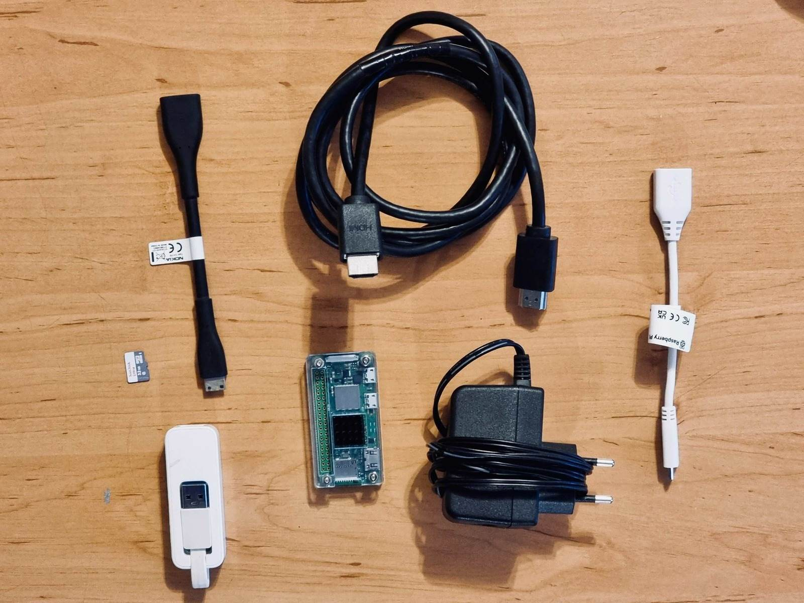
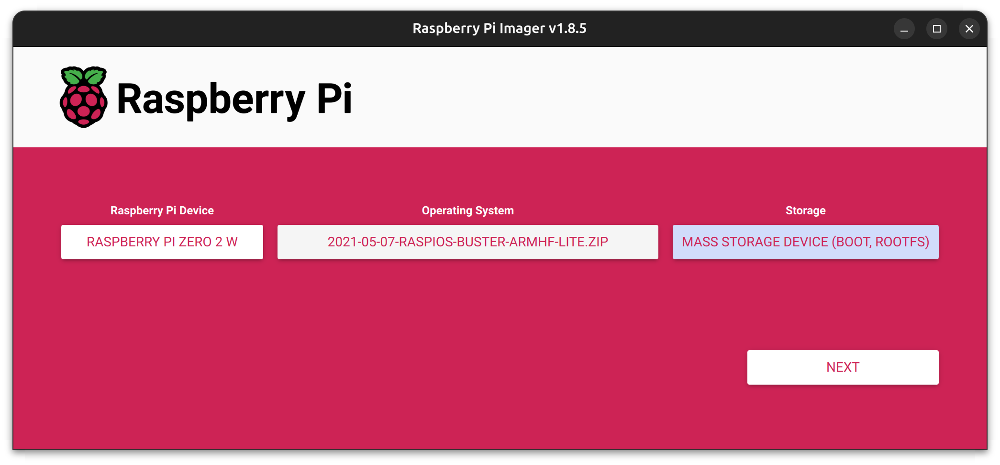
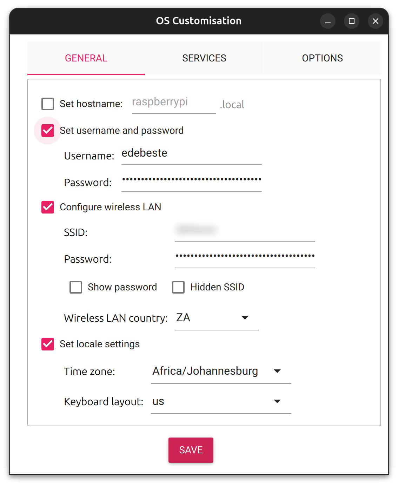
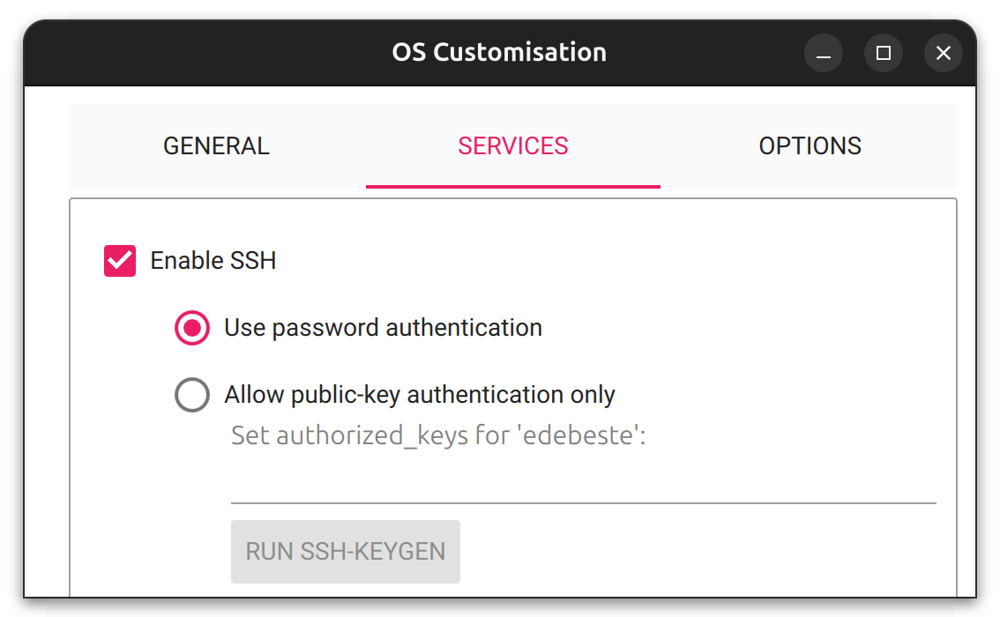
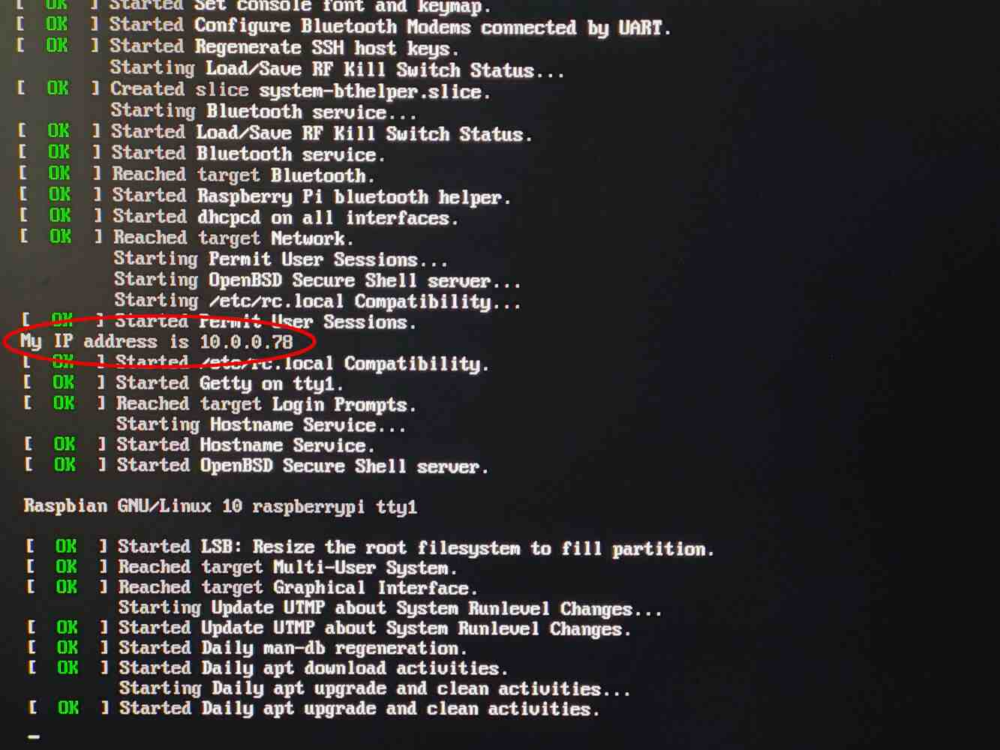
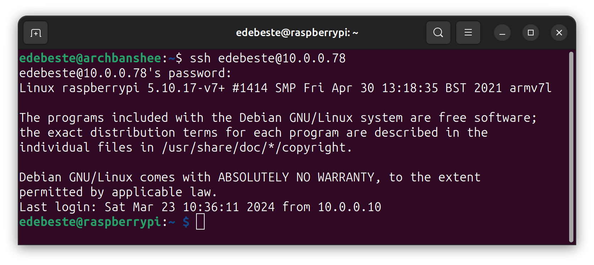
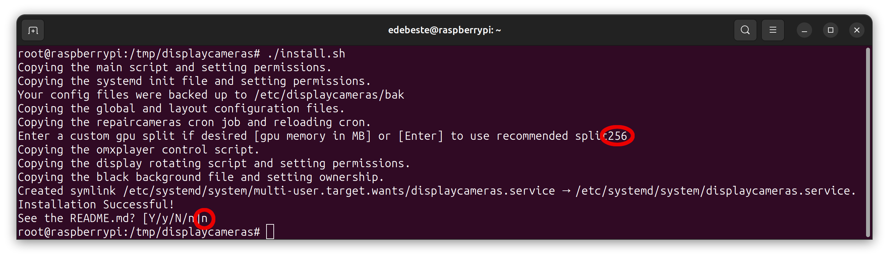
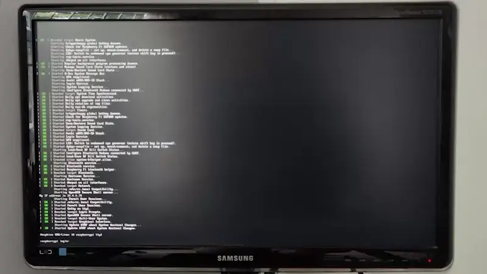

---
cover:
  image: "posts/2024-03-17-pi-zero2-cctv/banner.jpg"
  relative: false
  alt: "A person looking at a monitor with the Raspberry Pi logo and a Raspberry Pi Zero 2 W device in it. There is a camera in the top left pointed at the person."
  caption: "You are being watched."
author: "Eugene de Beste"
title: "Step Up Your Home Security Game on the Cheap With A Raspberry Pi Zero 2 W Powered CCTV Monitor"
date: "2024-03-23"
description: Not too long ago I set up a few IP cameras around the house. I wanted a non-proprietary way to monitor the feeds while I'm in my study. This blog post details my solution leveraging a Raspberry Pi Zero 2 W and an old computer monitor.
categories:
  - Technology
tags:
  - RaspberryPi
  - Security
  - Home Security
  - Cameras
  - IP Camera
  - CCTV

showtoc: true
TocOpen: true
---

Not too long ago I set up a few IP cameras around the house. As I work mostly from home, I wanted a non-proprietary and cost effective way to monitor four video feeds at any time while I'm in my study.

This blog post details the solution I came up with, which leverages a Raspberry Pi Zero 2 W and an old monitor I had lying around.

Before blindly following the instructions in this post, please consider the [caveats](#caveats)! 🙏

# Hardware Requirements



- A Raspberry Pi Zero 2 W.
  - (**Optional**) A USB OTG cable (if a wired connection is preferred over WiFi).
  - (**Optional**) A USB to Ethernet adapter (if a wired connection is preferred over WiFi).
  - (**Optional, but highly recommended!**) A heat sink and enclosure for the Pi.
  - A mini HDMI to HDMI breakout for the Pi.
  - A power supply for the Pi.
- A microSD card reader/writer for writing the Pi image.
- An old HDMI-compatible computer monitor, either one laying around or getting a cheap one on the second-hand market.
- An HDMI cable.

It's probably easiest to just buy a bundle for the Pi Zero 2 W, which normally includes most of the stuff needed on the Pi side.

# 0. Preparation

The only requirement before getting started is to download an older, archived 32-bit version of Raspberry Pi OS based on Debian 10 (Buster). The last released build is hosted here: https://downloads.raspberrypi.org/raspios_lite_armhf/images/raspios_lite_armhf-2021-05-28/2021-05-07-raspios-buster-armhf-lite.zip.

😱😱😱 A deprecated operating system? But what about security!

I know, I know, but the reason for this is that I leverage a tool for displaying the camera feeds which relies on an older video player called `omxplayer`. `omxplayer` supports the hardware acceleration on Pis, but is deprecated on newer versions of RaspiOS in favor of `vlc`. While `vlc` can do hardware acceleration in newer RaspiOS versions, I've (anecdotally) found that `omxplayer` has slightly better latency when streaming the feeds. 

The Pi is also connected to a secure internal network with limited routing and will only ever run an SSH server outside of the camera feed software so there shouldn't be much risk to it.

# 1. Flash the MicroSD Card

On a desktop/laptop, prepare the microSD card for the Pi.

The easiest way to flash an SD card for a Pi is to use _Raspberry Pi Imager_, which can be [downloaded from the Raspberry Pi website](https://www.raspberrypi.com/software/).

1. Open up _Raspberry Pi Imager_.
2. Click **CHOOSE DEVICE** and select "**Raspberry Pi Zero 2 W**"
3. Click **CHOOSE OS**, scroll down and click **Use custom** and then select the downloaded `2021-05-07-raspios-buster-armhf-lite.zip` file.
4. Click **CHOOSE STORAGE** and select the target SD card.

    It should look something like this:

    

5. Click **NEXT**.

    When presented with the OS customization window, click **EDIT SETTINGS**, make the appropriate changes to allow access to the booted operating system and click **SAVE**. For example, these are the settings I used:

    
    

    I intend to customise the hostname and additional properties later, so I just need to configure basic authentication and ensure that the device can connect to my network on first boot.

6. Once ready, click **YES** to apply the configuration and then **YES** when prompted to erase the SD card and wait for the writing to complete.

# 2. Access The Pi

Now to set up the Pi for remote access and in preparation for configuring the camera display software.


If a wired connection preferred over WiFi a USB OTG cable, USB to ethernet adapter and ethernet cable must now be connected to the Pi.


Using either a microHDMI to HDMI cable, or a microHDMI to HDMI adapter and a normal HDMI cable, connect the Pi to the chosen display, plug the power in and wait for it to boot up.

Once it's booted up, the DHCP IP address received by the Pi's network interface should be displayed in the boot logs.



This address can be used to establish an SSH connection with:

```shell
ssh <configured_username>@<pi_ip_address>
```

In my example, this would be:

```shell
ssh edebeste@10.0.0.78
```



# 3. Get _Displaycameras_

[_Displaycameras_](https://github.com/Anonymousdog/displaycameras) is my current software of choice. It's a wrapper around `omxplayer` and allows displaying video feeds in numerous ways, including various grid sizes and rotations between sets of cameras. It also has a relatively simple setup procedure.

With an SSH connection to the Pi, the following commands must be executed:

```shell
sudo su
cd /tmp
apt update
```


The following messages will present after running the `apt update` command:
```text
N: Repository 'http://raspbian.raspberrypi.org/raspbian buster InRelease' changed its 'Suite' value from 'stable' to 'oldoldstable'
N: Repository 'http://archive.raspberrypi.org/debian buster InRelease' changed its 'Suite' value from 'testing' to 'oldoldstable'
```
This is safe to ignore.



The `vim` package in the `apt install` line below can be replaced with a preferred text editor.


```shell
# Install dependencies for displaycameras
apt install git omxplayer fbi vim -y

# Download the source code for displaycameras
git clone https://github.com/Anonymousdog/displaycameras.git
cd displaycameras

# Install displaycameras
chmod +x install.sh
./install.sh
```

When prompted about setting up the GPU split, enter `256` and hit enter. Type `n` for seeing the README.md and hit enter, since it's in the [GitHub repo](https://github.com/Anonymousdog/displaycameras/blob/master/README.md).



Temporarily disable _Displaycameras_'s autostart on reboot. It'll be re-enabled later.

```shell
systemctl disable displaycameras
```

_Displaycameras_ is now installed on the Pi. 🎉🎉🎉

# 4. Configure the Pi

Before I could configure and use _Displaycameras_, I had to make some changes to the Pi's boot configuration due to what I presume to be framebuffer size issues when displaying 4 feeds at the same time. The workaround involves explicitly setting the framebuffer and display resolution to match the chosen monitor.

Reference this document: https://onlinelibrary.wiley.com/doi/pdf/10.1002/9781119415572.app3 and find the appropriate group (CEA or DMT) and the value that corresponds to the monitor. I use a 1080p computer monitor, so it would be HDMI Group `2` (DMT), with value `82`.

With the above information at hand, edit the `/boot/config` file and below the `gpu_mem=256` line (which was added by _Displaycameras_ and **should be the last line in the file**), add:

```ini
framebuffer_width=<x_pixels>
framebuffer_height=<y_pixels>
hdmi_group=<hdmi_group>
hdmi_mode=<hdmi_group_mode>
```

For my configuration, this results in:

```ini
framebuffer_width=1920
framebuffer_height=1080
hdmi_group=2
hdmi_mode=82
```

The Pi needs to be rebooted for the configuration change to apply:

```shell
reboot
```

# 5. Configure _Displaycameras_

_Displaycameras_ can now be configured to show the desired camera feeds.

First, uncomment `blank` in `/etc/displaycameras/displaycameras.conf` (line 14 at time of writing) and make sure it's set to `"true"`:
```ini
blank="true"
```

This will remove the boot text from the Pi's display before starting the camera feeds, leading to a nice clean black background.

The bulk of the configuration lies in `/etc/displaycameras/layout.conf.default`. Camera positions, rotations and feeds are defined here. A basic configuration that will match my setup is below:

```ini
# Window names
windows=(upper_left upper_right lower_left lower_right)

# Windows positions
window_positions=(
#First Row
#upper_left
# 960x540
"0 0 959 539" \
#upper_right
# 960x540
"960 0 1920 539" \

#Second Row (missing all but the far right window because large_left is double size
#lower_left
# 960x540
"0 540 959 1080" \
#lower_right
# 960x540
"960 540 1920 1080" \
)

# Camera Names
camera_names=(cam1 cam2 cam3 cam4)

# Camera Feeds
camera_feeds=( \
#cam1
"<url>" \
#cam2
"<url>" \
#cam3
"<url>" \
#cam4
"<url>" \
)

rotate="false"
```

My example setup defines 4 camera previews of around 960x540 pixels each on a single display. I leave a gap of a single pixel between each of them so that there is a little black divider to separate them, hence the "959"s and the "539"s.


For additional example layouts, check out this [GitHub link](https://github.com/Anonymousdog/displaycameras/tree/master/example_layouts).

For more information about layouts read the [layout.conf.default file's comments](https://github.com/Anonymousdog/displaycameras/blob/master/layout.conf.default).


Now that the layout is defined, _Displaycameras_ can be enabled for autostarting on boot, and then started.

```
systemctl enable displaycameras
systemctl restart displaycameras
```

💥 **Voilà** 💥



# Caveats

I want to highlight some caveats that exist with this setup, namely:

- **_Displaycameras_ is old software** that is seemingly no longer maintained, that being said it still works well.
- If more functionality is required or a newer project that uses a newer base operating system (with `vlc` instead of `omxplayer`) is required, check out [rpsurv](https://github.com/SvenVD/rpisurv).
- I did not test **audio**. I don't require it as I don't currently record audio on my security.
- I did not test **rotations** or **more than 4 camera feeds**. I don't currently need it and probably won't for the forseeable future.
- **Multiple high-resolution camera feeds will likely not work on the Pi Zero 2 W** and a more powerful device may be needed. When testing with multiple 1080p streams, I encountered screen flickering and blanking that I wasn't able to solve.

# Conclusion

And there it is, a relatively simple and cost effective way to create a security camera monitor using a Raspberry Pi Zero 2 W and an old or second-hand display. My next steps are to mount it up on the wall and have the monitor and Pi turn on/off together, but that's for another day.

Even with the [caveats](#caveats) listed above, this setup is perfect for my needs and hopefully it helps someone who is looking to set up something similar. Thanks for reading and feedback and/or comments are welcome! 🙂