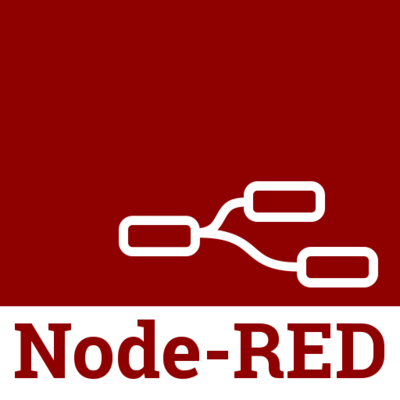
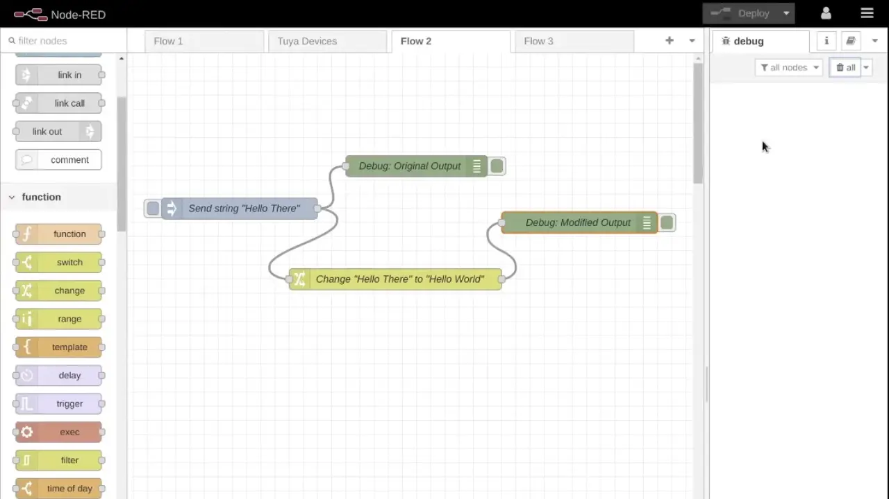
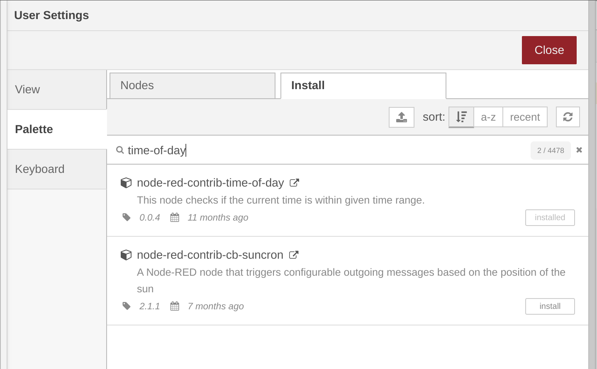
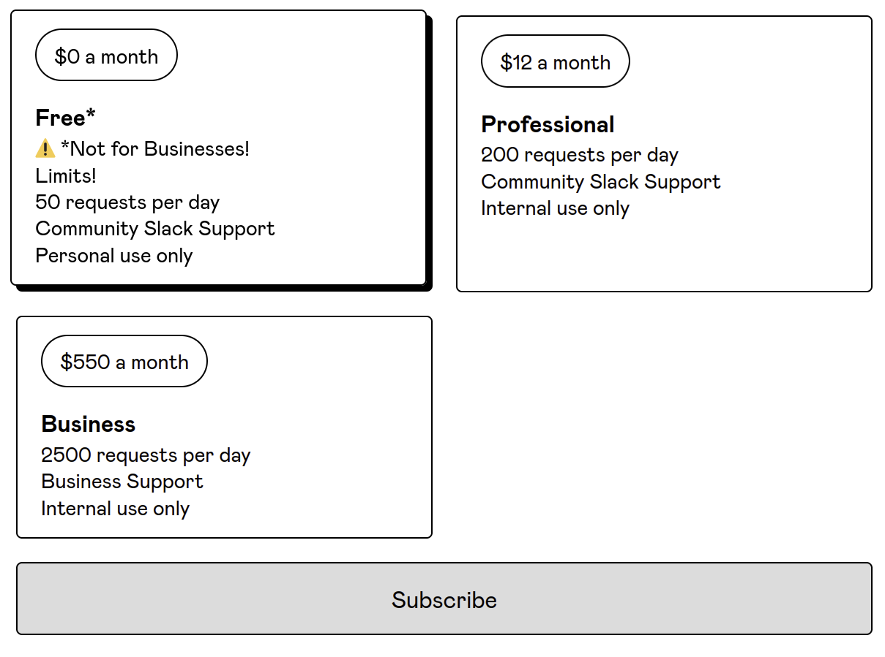
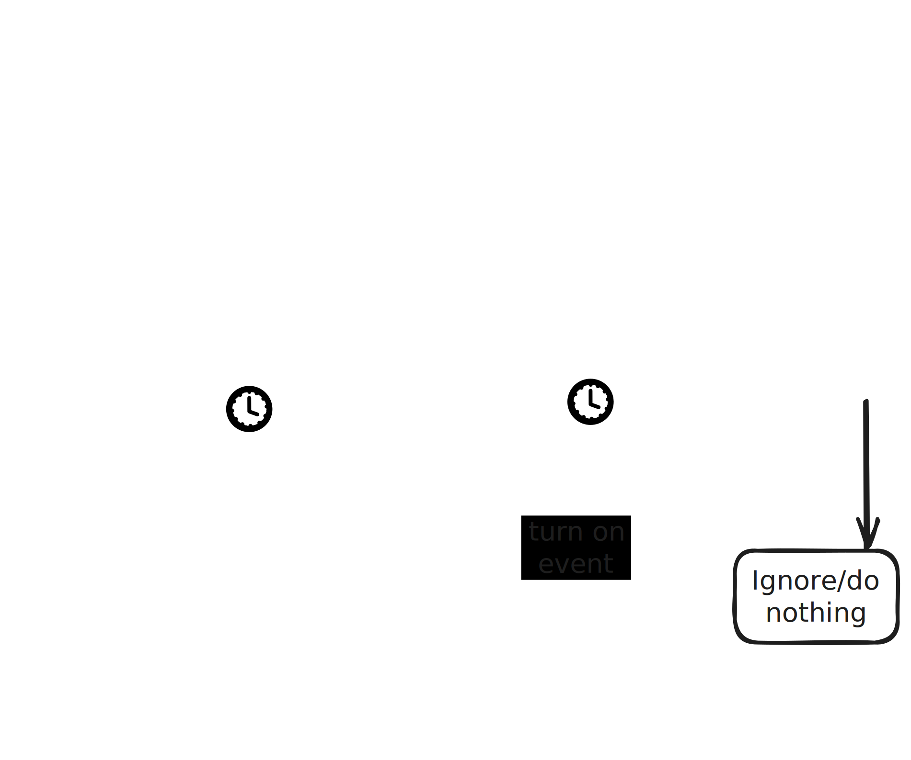

---
cover:
  image: "posts/2023-07-09-loadshedding-automation-esp-nodered/header.png"
  #relative: false
  alt: "Node-RED and ESP"
author: "Eugene de Beste"
title: "Tame load shedding: Automating Smart Devices Using Node-RED and EskomSePush's API"
date: "2023-07-09"
description: "Say goodbye to manually turning lights on and off 😉. EskomSePush offers an API. With Node-RED in hand, let's take advantage of this to switch devices on and off when load shedding strikes."
categories:
    - Technology
tags:
    - Node-RED
    - Load Shedding
    - Eskom
    - EskomSePush
    - API
    - Automation
    - Home Automation

TocOpen: true
draft: true
---

South Africa faces something called "load shedding," which is a fancy politically-driven synonym for "rolling blackouts." South African citizens historically struggled to get up-to-date and relatively punctual information regarding changes to the schedules for the blackouts. That's where EskomSePush comes in.

EskomSePush (ESP) is fantastic. The guys who made the app had an amazing opportunistic idea and implemented it wonderfully. It's got a great UI, the ads aren't overly intrusive and its alerts are *mostly* punctual.

Something you may not know is that they offer an API to query load shedding schedules. Yes, that's right! An **API which opens up a world of potential automation solutions**.

I recently used this to automate some smart devices in my home, and plan to expand it to more. This blog post focuses on my experiences getting ESP data into Node-RED, and using it to automate some lights.

# Background: My Setup

## Controller

So, why Node-RED? Well, in my case, it's quite simple, really. I have a 24V/3000VA [Victron Energy](https://www.victronenergy.com) based inverter and solar setup. Here it is:



To connect my setup to the internet and control it remotely, I use a device in their ecosystem called the "**Cerbo GX**". This device makes communication between all the Victron equipment I have, the batteries, and their internet-based remote monitoring service possible.



More importantly (for the purposes of this blog), the Cerbo GX comes with community support for the Node-RED platform. As such, I don't need to run another automation platform that I have to manage myself. Node-RED gets automatically updated along with my device firmware, and it also allows me to interact with the inverter via the Node-RED platform, thanks to the Node-RED functions provided by Victron.

## Devices

My partner has these Himalayan salt lamps. Yes, those crystal looking ones. They use oven bulbs that give off a good amount of heat to keep the salt crystal's structure intact and prevent moisture damage.

These bulbs have 2 issues:

  - They aren't very power efficient, but hey, not much we can do about that.
  - The filaments inside the bulbs are pretty sensitive to power fluctuations.

The work that this blog post is based on set out to ensure that the bulbs are spared the load shedding situation we're currently dealing with.

# What Is Node-RED?

<figure>
    
    <figcaption style="padding-top: 15px; font-size: 13px; text-align: center"><i>The Node-RED logo.</i></figcaption>
</figure>

Node-RED is a visual, flow-based automation-focused programming tool based on Node.js. Node-RED gives you "nodes", which are functions with predefined inputs and outputs. You can link these inputs and outputs to create a "flow", which is basically a program that does things based on what you decide.

Basically, it lets you write code without being a software engineer or knowing how to write code in a specific language. That makes it easy to get into.

<figure>
    
    <figcaption style="padding-top: 15px; font-size: 13px; text-align: center"><i>A simple Node-RED flow.</i></figcaption>
</figure>

Node-RED provides a community "marketplace" of sorts, that allows users to write and publish nodes to for other users to consume. This allows great flexibility for expanding functionality. It also provides a general _**function**_ node, that allows users who need advanced functions to inject their own JavaScript and define the inputs and outputs of the node.

<figure>
    
    <figcaption style="padding-top: 15px; font-size: 13px; text-align: center"><i>Node-RED community marketplace.</i></figcaption>
</figure>

# EskomSePush's API

Now that we know a little about Node-RED, let's talk about ESP's API. They actually advertise their API right there on [their website](https://esp.info/) (just scroll down to the bottom).

Anyway, you can get a subscription for to use their API here: https://eskomsepush.gumroad.com/l/api. They have 3 plans. _Free*_, _Professional_ and _Business_.

<figure>
    
    <figcaption style="padding-top: 15px; font-size: 13px; text-align: center"><i>EskomSePush API pricing.</i></figcaption>
</figure>

I'm using the **Free** subscription because querying the API every 30 minutes throughout the day uses 48 of the available calls, leaving only 2 extra. This suits my needs for the most part, but there are situations where load shedding changes can occur between the 30-minute intervals and impact you unexpectedly. But hey, it's free.

# The Plan

I'm starting off simple here, but I plan to expand on this idea in the future. Right now, my goal is pretty straightforward:

- I want to find out when the next load shedding session is scheduled for my area.
- I want to turn off the lights 5 minutes before that session is supposed to start.
- I want to turn the lights back on 5 minutes after that session is supposed to end.

To make this happen, I thought of using Node-RED to:

1. Get the load shedding schedule from EskomSePush's API.
2. Set a timer to go off 5 minutes before the next load shedding period begins.
3. Set another timer to go off 5 minutes after the next load shedding period ends.
4. Make sure these timers only activate when it's appropriate, using a "time-of-day checker" to avoid any disruptions during my sleep.
5. Control smart switches to turn them on or off based on the timers and the time of day.

<figure>
    
    <figcaption style="padding-top: 15px; font-size: 13px; text-align: center"><i>The plan.</i></figcaption>
</figure>

# Implementation

Firing up the Node-RED interface, the first thing 

# The Result

# Conclusion