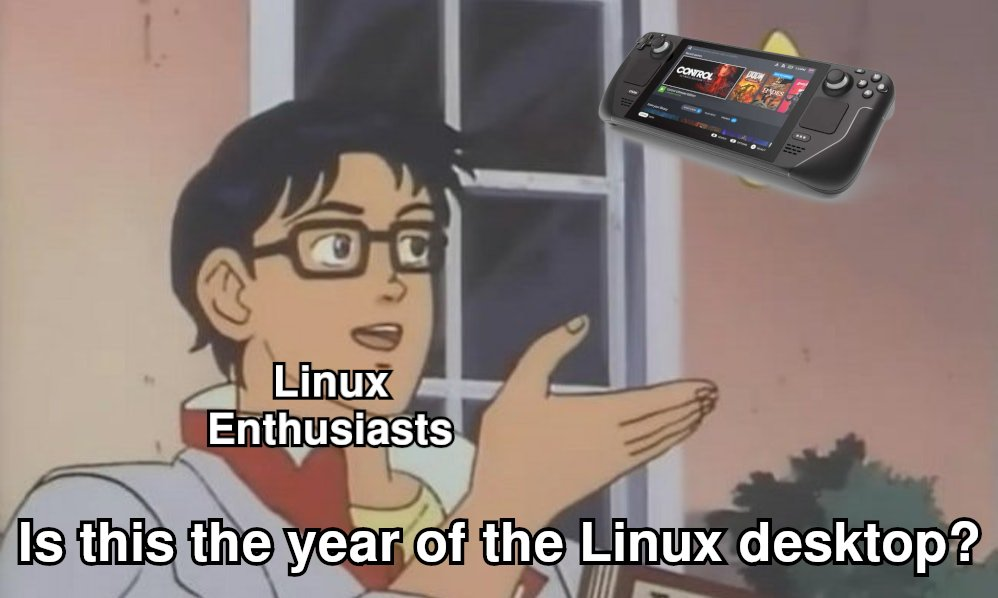
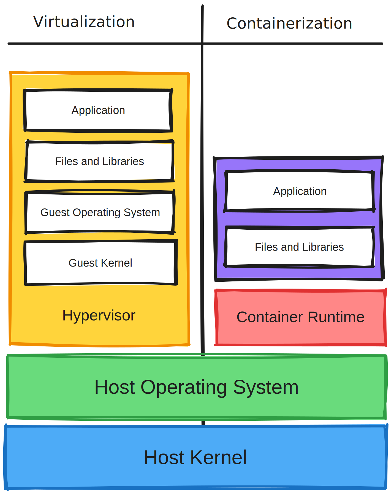
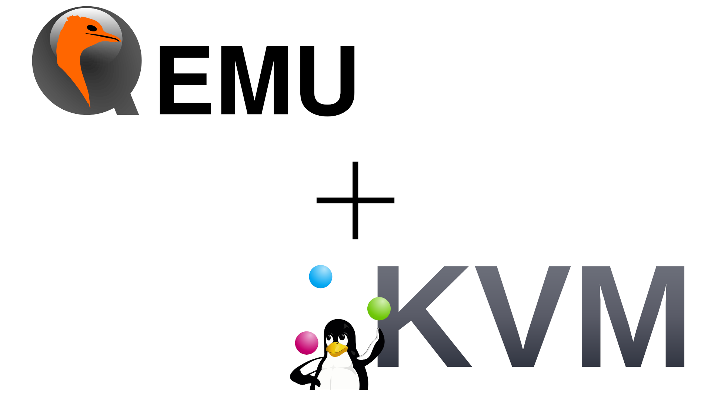
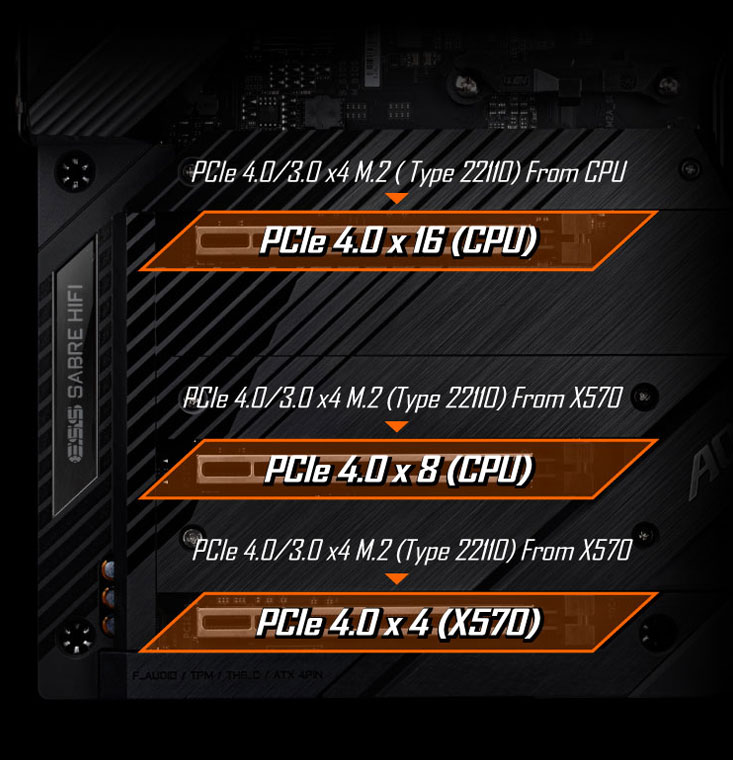

## Preamble

During my undergraduate years, I became increasingly dissatisfied with the Windows workflow and experimented more regularly with Linux. It began with Ubuntu and Mint and eventually culminated in ArchLinux. That journey is perhaps a story for another blog post, but suffice it to say that with its great community, the Arch User Repository (AUR) and particularly its rolling release update scheme, ArchLinux keeps my ADHD brain very satisfied. The transition was mostly smooth, and I felt quite at home in the Linux ecosystem. I spent a lot of time tweaking and compiling software, including the Linux kernel.

The area of running Windows-native video games on Linux was not as simple as it is today and did not have nearly the compatibility that we see nowadays. Valve has done absolute wonders for the Linux gaming community by heavily investing in [Proton](https://github.com/ValveSoftware/Proton), their fork of [Wine](https://www.winehq.org/), and other Linux drivers and tools. We're at the point today where many Windows-only titles work via Steam/Proton with a simple double click from the Steam interface. A lot of this was driven by their investment in hardware, such as the failed Steam Machines and the **very** successful SteamDeck, where the latter is primarily powered by Linux. Maybe we truly are living in "**_the year of the linux desktop_**".

<figure>
  
  <figcaption>Shamelessly stolen from <a href="https://twitter.com/nixcraft/status/1418055967477047302">@nixcraft on Twitter</a></figcaption>
</figure>

Back in the day, you had to struggle with a relatively dismal compatibility list for games with Wine. A good chunk of older games would work, but recent or modern games would almost exclusively not. Sometimes you could get more advanced or recent games to work, but they often required bespoke tweaks and configurations that were typically not user-friendly and required experience with Linux tooling. You could mostly forget about online multiplayer games!

While I was quite willing to tweak, patch, and tune, there were games I wanted to play that would not be feasible at that time. I had a desktop machine with an Intel Core i7-4790k, 16GB of RAM, and an Nvidia GeForce GTX670. The prospect of the GPU going to waste led me to dual boot my Linux OS alongside Windows. This wasn't ideal as I didn't like the wait for the switch over, and I didn't always want to drop everything I was doing on Arch in order to boot Windows and play games. Then, towards the end of my undergraduate studies, I had an idea:

>_What if there was a way to create a virtual machine on my Linux desktop and give it a graphics card? That would give me the best of both worlds_.

This post will discuss virtualization with PCI passthrough, which enables a virtual machine to leverage a hardware device, such as a GPU, to utilize the component with a different operating system without the requirement to restart your computer. Please keep in mind that it is baised towards my experiences.

---

## Concepts and Terms

This section won't be an exhaustive list of concepts and their descriptions, but some cherry-picked ones that I believe are quite important to understand.

### Virtualization

Virtualization came out of a desire to maximise the utilisation of physical hardware and for portability of software. Before containers were so common, people used to create virtual machines for their applications in order to ship dependencies or scale their services. It’s hard to believe, because it seems like such a clunky approach compared to what we have now, but containers were not well developed or as ubiquitous. The general idea is that you have some agent or driver, referred to as a “hypervisor” which is responsible for mimicking what actual hardware would look like to an operating system. This hypervisor will reserve hardware (such as memory) for use by the guest.

The guest operating system’s full stack is installed to a physical or virtualised drive. This means that the kernel, operating system, libraries and everything else are installed. The operating system inside the virtual machine may never know that it is not running on physical hardware.

<figure>
  
  <figcaption>Visualisation of the difference between virtual machines and containers.</figcaption>
</figure>

### QEMU and KVM

QEMU is a hypervisor that runs on many different platforms, such as Linux Windows and macOS. You can think of it like an alternative to Virtualbox or VMware.

QEMU can take advantage of a Linux kernel features called the Kernal-based Virtual Machine, or KVM for short. KVM is a feature of the Linux kernel that greatly enhances performance of virtualized applications by allowing a better, more direct path for virtual functions to the actual underlying hardware of the machine. When running QEMU on Linux, it's generally recommeded to use KVM acceleration for performance and security reasons.

<figure>
  
  <figcaption>QEMU and KVM, a match made in digital heaven.</figcaption>
</figure>

### Device Passthrough

Device passthrough is a term used to describe the capability of allowing a guest operating system in a virtual machine to directly access a host device. To illustrate, let's consider a scenario where you have a Linux host and a Windows guest. Device passthrough can be as straightforward as connecting a USB thumb drive to your computer and observing it appearing as a native thumb drive within the Windows guest. Even though it may appear to bypass the host, it is important to note that there are still processes that manage this passthrough. This serves as one example, but achieving device passthrough for various device types necessitates different backend functions.

A very important aspect of this, for the purposes of this blog post, is PCI passthrough. This refers to the act of making a host PCI(e) device appear to the virtualized guest operating system as if it were using the hardware directly. PCI passthrough can be achieved in multiple ways. This blog post will describe the two most common methods: _**whole-device PCI passthrough with the Input/Output Memory Management Unit (IOMMU)**_ and _**Single Root Input/Output Virtualization (SR-IOV)**_.

#### Whole-device PCI passthrough

Whole-device PCIe passthrough is much more accessible than SR-IOV as it does not require the PCIe device to have any special hardware functionality to support it. Typically, the only requirement is a platform (motherboard) that supports mapping PCIe devices to individual IOMMU groups, along with hardware-assisted virtualization features of the CPU being used, such as Intel VT-d and AMD-Vi. These features are quite common in consumer computer components today.

To better understand this, let's consider an example: Suppose you have a GPU that you want to pass through to a virtual machine. If your motherboard and CPU support IOMMU grouping but places the GPU and the controller for your front-panel USB connectors in the same IOMMU group, both the GPU and the controller will be passed to the virtual machine. This situation is not ideal as there is potential for incorrect memory addressing and conflicts.

That being said, there are ways to potentially overcome platforms that don't group devices into isolated IOMMU groups. Efforts, such as the _**Access Control Services (ACS)**_ for the Linux kernel, change the way that IOMMU works and allow subgrouping of IOMMU groups. This isn't supported by every Linux kernel shipped with operating systems (although a superuser could patch their kernel to support it), nor by every hardware combination, and it depends on the platform, hardware devices, and the Linux kernel. However, it may allow those with unideal default IOMMU groupings to achieve passthrough as well.

Here is an example of relatively ideal IOMMU groups (taken from the [ArchLinux Wiki on PCI passthrough](https://wiki.archlinux.org/title/PCI_passthrough_via_OVMF)):

```shell
IOMMU Group 1:
	00:01.0 PCI bridge: Intel Corporation Xeon E3-1200 v2/3rd Gen Core processor PCI Express Root Port [8086:0151] (rev 09)
IOMMU Group 2:
	00:14.0 USB controller: Intel Corporation 7 Series/C210 Series Chipset Family USB xHCI Host Controller [8086:0e31] (rev 04)
IOMMU Group 4:
	00:1a.0 USB controller: Intel Corporation 7 Series/C210 Series Chipset Family USB Enhanced Host Controller #2 [8086:0e2d] (rev 04)
IOMMU Group 10:
	00:1d.0 USB controller: Intel Corporation 7 Series/C210 Series Chipset Family USB Enhanced Host Controller #1 [8086:0e26] (rev 04)
IOMMU Group 13:
	06:00.0 VGA compatible controller: NVIDIA Corporation GM204 [GeForce GTX 970] [10de:13c2] (rev a1)
	06:00.1 Audio device: NVIDIA Corporation GM204 High Definition Audio Controller [10de:0fbb] (rev a1)
```

As you can see from the above, the GPU (and it's audio controller) are both in a single IOMMU group (13). This means that it should be relatively simple to pass the device through to a virtual machine.

#### SR-IOV

SR-IOV is a hardware-supported feature that enables a physical PCIe-based device to be divided into multiple virtual functions (VFs). These virtual functions can be allocated to different virtual machines, allowing for improved resource sharing and allocation. SR-IOV can enhance device utilization and therefore can be particularly valuable in enterprise and cloud environments. The biggest caveat is that it requires support from the device itself and the platform it is connected to (think: motherboard). SR-IOV VF passthrough typically utilizes IOMMU as well.

Here is the `lspci` output as example of an Intel 82576 PCIe network adapter with numerous VFs enabled by SR-IOV (taken from the [RedHat documentation on using SR-IOV](https://access.redhat.com/documentation/en-us/red_hat_enterprise_linux/7/html/virtualization_deployment_and_administration_guide/sect-pci_devices-pci_passthrough)):

```shell
# lspci | grep 82576
0b:00.0 Ethernet controller: Intel Corporation 82576 Gigabit Network Connection (rev 01)
0b:00.1 Ethernet controller: Intel Corporation 82576 Gigabit Network Connection (rev 01)
0b:10.0 Ethernet controller: Intel Corporation 82576 Virtual Function (rev 01)
0b:10.1 Ethernet controller: Intel Corporation 82576 Virtual Function (rev 01)
0b:10.2 Ethernet controller: Intel Corporation 82576 Virtual Function (rev 01)
0b:10.3 Ethernet controller: Intel Corporation 82576 Virtual Function (rev 01)
0b:10.4 Ethernet controller: Intel Corporation 82576 Virtual Function (rev 01)
0b:10.5 Ethernet controller: Intel Corporation 82576 Virtual Function (rev 01)
0b:10.6 Ethernet controller: Intel Corporation 82576 Virtual Function (rev 01)
0b:10.7 Ethernet controller: Intel Corporation 82576 Virtual Function (rev 01)
0b:11.0 Ethernet controller: Intel Corporation 82576 Virtual Function (rev 01)
0b:11.1 Ethernet controller: Intel Corporation 82576 Virtual Function (rev 01)
0b:11.2 Ethernet controller: Intel Corporation 82576 Virtual Function (rev 01)
0b:11.3 Ethernet controller: Intel Corporation 82576 Virtual Function (rev 01)
0b:11.4 Ethernet controller: Intel Corporation 82576 Virtual Function (rev 01)
0b:11.5 Ethernet controller: Intel Corporation 82576 Virtual Function (rev 01)
```

---

## Building the Virtual Machine


Please keep in mind that the instructions provided in this tutorial are based on my specific hardware and software setup and they may not directly apply to your own configuration. However, the principles discussed here should hopefully have equivalents or similar concepts that can be adapted to your system.


### Hardware Notes

Let's start by briefly discussing my current computer. The hardware is as follows:

|                             |                                          |
|-----------------------------|------------------------------------------|
| **OS**                      | ArchLinux                                |
| **Kernel**                  | Arch LTS                                 |
| **CPU**                     | AMD Ryzen 9 5950X                        |
| **Motherboard**             | Gigabyte Aorus Master X570               |
| **RAM**                     | 32GB (2x 16GB) Corsair Vengeance 4000MHz |
| **GPU 1 (for host)**        | Nvidia Quadro P2000                      |
| **GPU 2 (for passthrough)** | Asus TUF RTX 4090                        |
| **PSU**                     | Corsair AX850                            |

Unlike many of Intel's CPUs, AMD's non-APU CPUs, such as the Ryzen 9 5950X in my case, do not have on-die GPUs. This is totally fine if you want to do headless GPU passthrough, but it can put you at a slight disadvantage if you want to have a dual-GPU passthrough solution.

This is what I wanted to achieve with the hardware platform:
- I didn't want to go headless, I wanted my host and guest to have display outputs from separate GPUs.  
- I wanted my guest to have a GPU with its full allotment of PCIe lanes.

Achieving these requirements limits the available options for purchase. When I was doing my research to support my requirements, I stumbled across the **Gigabyte Aorus Master X570**. The reason this motherboard worked perfectly for me is that it has features that I liked outside of the requirements for the PCI passthrough. More importantly, it had two sets of PCIe lanes: one set directly connected to the CPU (20 lanes) and an additional 4 PCIe lanes that were connected to the chipset on the motherboard. **This meant that I could populate the RTX 4090 along with an M.2 NVMe drive in the CPU-bound set, and I could put the Quadro P2000 in the chipset-bound set**.

<figure>
  
  <figcaption>This illustration is for the Aorus Extreme X570, but it is funcionally similar to the Master.</figcaption>
</figure>

### Software Notes

#### BIOS Configuration

Some changes need to be made in most BIOS interfaces to facilitate IOMMU groups and/or device virtualization acceleration. For Intel-based platforms, you will need to enable **"Intel VT-d"** and **"Intel VT-x" or "Intel Virtualization Technology"**. For AMD, you will have to look for settings along the lines of **"SVM"** and **"AMD-V"**. Essentially, you need to enable CPU virtualization acceleration features as well as device virtualization acceleration features for either platform.

Look through the BIOS and enable any features that are related to **IOMMU or IOMMU groups**. Some motherboards may not have settings specifically for this and the configuration may be inferred based on other settings being enabled or disabled. Consult your motherboard manual for more information.

#### Linux Kernel Parameters

Most operating systems do not ship with support for IOMMU grouping enabled by default, and this is true for ArchLinux. In order to enable support for the PCI passthrough functionality, we need to make some modifications. Your bootloader configuration needs to be updated to include `intel_iommu=on` **if you are using an Intel CPU**. If you are on the AMD platform, enabling the required settings in the BIOS for AMD virtualization extensions should enable IOMMU grouping by default.

#### OS and Virtual Machine Configuration

Now on to the good part.

We mneed to prepare the (vfio-pci)

If you want to use PCI passthrough effectively, you'll need to utilize the Open Virtual Machine Firmware (OVMF) project. This project aims to provide a UEFI firmware for a virtual machine to initialize from. This is needed as modern GPUs typically require UEFI for PCI passthrough to function properly. Your Linux distribution instructions will vary, but for ArchLinux, it's as simple as going `pacman -Syy && pacman -S edk2-ovmf`. 

My favourite tool suite for managing QEMU on Linux is libvirt and Virt Manager. Libvirt is a library that abstracts various hypervisors and provides the user with a common language to interact with them, while Virt Manager is a frontend for libvirt, offering a nice GUI for defining and configuring virtual machines.

